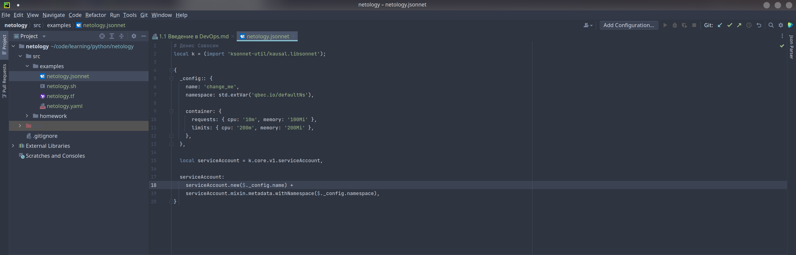

Выполнение [домашнего задания](https://github.com/netology-code/sysadm-homeworks/blob/devsys10/01-intro-01/README.md)
по теме "Введение в DevOps".

## Q/A

### Задача 1

### Задача 2

Описание жизненного цикла задачи:

1. Постановка задачи (менеджер)
2. Оценка задачи (менеджер + разработчик)
3. Решение задачи (разработчик)
4. Ревью изменений (девопс + разработчик)
5. Тестирование изменений (тестировщик)
6. Сбор новой версии (девопс + менеджер)
7. Деплой новой версии (девопс)
8. Мониторинг после деплоя (девопс + разработчик)