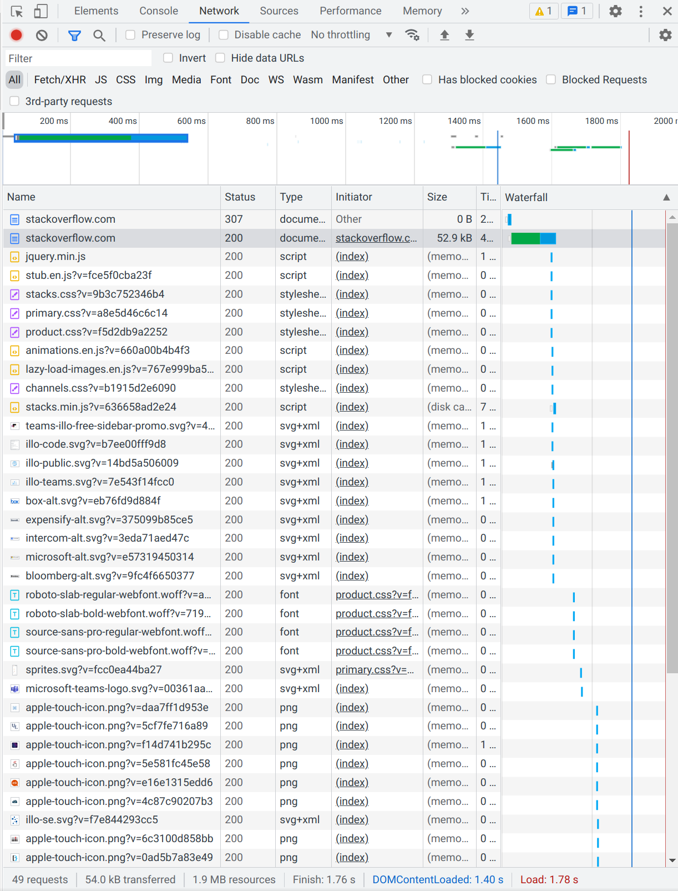

Выполнение [домашнего задания](https://github.com/netology-code/sysadm-homeworks/blob/devsys10/03-sysadmin-06-net/README.md) 
по теме "3.6. Компьютерные сети, лекция 1".

## Q/A

### Задача 1

> Работа c HTTP через телнет.

```shell
telnet stackoverflow.com 80
Trying 151.101.1.69...
Connected to stackoverflow.com.
Escape character is '^]'.
GET /questions HTTP/1.0
HOST: stackoverflow.com

HTTP/1.1 301 Moved Permanently
cache-control: no-cache, no-store, must-revalidate
location: https://stackoverflow.com/questions
x-request-guid: 345ccd64-092f-4bed-a6bb-f55d978ab74a
feature-policy: microphone 'none'; speaker 'none'
content-security-policy: upgrade-insecure-requests; frame-ancestors 'self' https://stackexchange.com
Accept-Ranges: bytes
Date: Wed, 09 Mar 2022 02:50:15 GMT
Via: 1.1 varnish
Connection: close
X-Served-By: cache-hhn4072-HHN
X-Cache: MISS
X-Cache-Hits: 0
X-Timer: S1646794215.885878,VS0,VE156
Vary: Fastly-SSL
X-DNS-Prefetch-Control: off
Set-Cookie: prov=a65f8cdf-ae94-33aa-2d32-b4ba53feba61; domain=.stackoverflow.com; expires=Fri, 01-Jan-2055 00:00:00 GMT; path=/; HttpOnly
```

В ответ пришёл статус код `301`, который означает постоянное перемещение с запрашиваемой страницы.

### Задача 2

> Повторите задание 1 в браузере, используя консоль разработчика F12.

Код ответа при заходе на сайт `http://stackoverflow.com`: `Status Code: 307 Internal Redirect`.
Наиболее долгих по загрузке запрос - это запрос на загрузку самой страницы после редиректа (`https://stackoverflow.com/`).
Скриншот консоли браузера: 



### Задача 3

> Какой IP адрес у вас в интернете?

Чтобы узнать текущий внешний ip-адрес, можно воспользоваться онлайн сервисами, такими как [myip.com](https://www.myip.com/) или [whoer.net](https://whoer.net/).
В дополнение к этому, можно использовать только консоль и команду `dig`:

```shell
dig +short myip.opendns.com @resolver1.opendns.com
46.181.144.146

dig TXT +short o-o.myaddr.l.google.com @ns1.google.com
"46.181.144.146"
```

Ответ: `46.181.144.146`.

### Задача 4

> Какому провайдеру принадлежит ваш IP адрес? Какой автономной системе AS?

```shell
whois 46.181.144.146

<...>

% Information related to '46.181.128.0/18AS39927'

route:          46.181.128.0/18
descr:          Goodline.info
origin:         AS39927
mnt-by:         ELT-MNT
created:        2010-12-22T11:28:33Z
last-modified:  2010-12-22T11:28:33Z
source:         RIPE
```

Ответ: оператор - `Goodline.info`, AS - `AS39927`.

### Задача 5

> Через какие сети проходит пакет, отправленный с вашего компьютера на адрес 8.8.8.8? Через какие AS?

По умолчанию утилита `traceroute` не установлена в системе ubuntu. Для её установки достаточно выполнить команду

```shell
sudo apt install traceroute
```

Ответ:

```shell
traceroute -A 8.8.8.8
traceroute to 8.8.8.8 (8.8.8.8), 30 hops max, 60 byte packets
 1  router.asus.com (192.168.1.1) [*]  5.960 ms  3.192 ms  3.129 ms
 2  46-181-144-129.shah-95-kmr-cr01-6500.net.elt (46.181.144.129) [AS39927]  6.523 ms  6.484 ms  6.446 ms
 3  172.16.23.174 (172.16.23.174) [*]  6.577 ms  6.539 ms  6.502 ms
 4  172-16-22-178.kras-136-kmr-asbr01-asr.net.elt (172.16.22.178) [*]  5.984 ms  10.393 ms  10.354 ms
 5  host_91_221_180_4.milecom.ru (91.221.180.4) [AS13094]  56.869 ms  56.832 ms  56.796 ms
 6  108.170.250.34 (108.170.250.34) [AS15169]  54.496 ms  51.426 ms 108.170.250.66 (108.170.250.66) [AS15169]  51.329 ms
 7  * * *
 8  108.170.232.251 (108.170.232.251) [AS15169]  72.746 ms 72.14.238.168 (72.14.238.168) [AS15169]  62.523 ms 172.253.65.82 (172.253.65.82) [AS15169]  64.747 ms
 9  216.239.46.139 (216.239.46.139) [AS15169]  68.148 ms 72.14.236.73 (72.14.236.73) [AS15169]  69.164 ms 172.253.51.241 (172.253.51.241) [AS15169]  69.121 ms
10  * * *
11  * * *
12  * * *
13  * * *
14  * * *
15  * * *
16  * * *
17  * * *
18  * * *
19  * dns.google (8.8.8.8) [AS15169]  57.661 ms  56.687 ms
```

### Задача 6

> Повторите задание 5 в утилите mtr. На каком участке наибольшая задержка - delay?

```shell
mtr -w 8.8.8.8
Start: 2022-03-09T10:25:09+0700
HOST: host                                            Loss%   Snt   Last   Avg  Best  Wrst StDev
  1.|-- router.asus.com                                0.0%    10    2.9   3.3   2.5   4.6   0.8
  2.|-- 46-181-144-129.shah-95-kmr-cr01-6500.net.elt   0.0%    10    4.0   4.0   2.5   5.5   1.1
  3.|-- 172.16.23.174                                  0.0%    10    4.1   4.4   3.1   6.0   0.9
  4.|-- 172-16-22-178.kras-136-kmr-asbr01-asr.net.elt  0.0%    10    4.3   4.2   3.5   5.5   0.6
  5.|-- host_91_221_180_4.milecom.ru                   0.0%    10   57.9  55.7  54.5  57.9   1.0
  6.|-- 108.170.250.146                                0.0%    10   55.7  55.4  54.4  56.4   0.7
  7.|-- 209.85.249.158                                50.0%    10   58.7  63.8  58.7  81.0   9.6
  8.|-- 216.239.57.222                                 0.0%    10   62.5  62.3  61.5  64.3   0.9
  9.|-- 142.250.238.181                                0.0%    10   66.4  66.0  65.3  66.9   0.5
 10.|-- ???                                           100.0    10    0.0   0.0   0.0   0.0   0.0
 11.|-- ???                                           100.0    10    0.0   0.0   0.0   0.0   0.0
 12.|-- ???                                           100.0    10    0.0   0.0   0.0   0.0   0.0
 13.|-- ???                                           100.0    10    0.0   0.0   0.0   0.0   0.0
 14.|-- ???                                           100.0    10    0.0   0.0   0.0   0.0   0.0
 15.|-- ???                                           100.0    10    0.0   0.0   0.0   0.0   0.0
 16.|-- ???                                           100.0    10    0.0   0.0   0.0   0.0   0.0
 17.|-- ???                                           100.0    10    0.0   0.0   0.0   0.0   0.0
 18.|-- ???                                           100.0    10    0.0   0.0   0.0   0.0   0.0
 19.|-- dns.google                                     0.0%    10   58.5  58.5  57.6  60.3   0.8
```

Наибольшая задержка была на 7-ом хопе с худшим показателем в 81ms.

### Задача 7

> Какие DNS сервера отвечают за доменное имя `dns.google`? Какие A записи?

```shell
dig dns.google

; <<>> DiG 9.16.1-Ubuntu <<>> dns.google
;; global options: +cmd
;; Got answer:
;; ->>HEADER<<- opcode: QUERY, status: NOERROR, id: 59679
;; flags: qr rd ra; QUERY: 1, ANSWER: 2, AUTHORITY: 0, ADDITIONAL: 1

;; OPT PSEUDOSECTION:
; EDNS: version: 0, flags:; udp: 65494
;; QUESTION SECTION:
;dns.google.			IN	A

;; ANSWER SECTION:
dns.google.		370	IN	A	8.8.4.4
dns.google.		370	IN	A	8.8.8.8

;; Query time: 8 msec
;; SERVER: 127.0.0.53#53(127.0.0.53)
;; WHEN: Ср мар 09 10:28:19 +07 2022
;; MSG SIZE  rcvd: 71
```

Ответ: dns-сервера с ip-адресами `8.8.4.4` и `8.8.8.8`. Оба адреса являются `A`-записями.

### Задача 9

> Проверьте PTR записи для IP адресов из задания 7. Какое доменное имя привязано к IP?

```shell
dig -x 8.8.4.4 

; <<>> DiG 9.16.1-Ubuntu <<>> -x 8.8.4.4
;; global options: +cmd
;; Got answer:
;; ->>HEADER<<- opcode: QUERY, status: NOERROR, id: 33111
;; flags: qr rd ra; QUERY: 1, ANSWER: 1, AUTHORITY: 0, ADDITIONAL: 1

;; OPT PSEUDOSECTION:
; EDNS: version: 0, flags:; udp: 65494
;; QUESTION SECTION:
;4.4.8.8.in-addr.arpa.		IN	PTR

;; ANSWER SECTION:
4.4.8.8.in-addr.arpa.	53775	IN	PTR	dns.google.

;; Query time: 4 msec
;; SERVER: 127.0.0.53#53(127.0.0.53)
;; WHEN: Ср мар 09 10:33:09 +07 2022
;; MSG SIZE  rcvd: 73

dig -x 8.8.8.8 

; <<>> DiG 9.16.1-Ubuntu <<>> -x 8.8.8.8
;; global options: +cmd
;; Got answer:
;; ->>HEADER<<- opcode: QUERY, status: NOERROR, id: 3893
;; flags: qr rd ra; QUERY: 1, ANSWER: 1, AUTHORITY: 0, ADDITIONAL: 1

;; OPT PSEUDOSECTION:
; EDNS: version: 0, flags:; udp: 65494
;; QUESTION SECTION:
;8.8.8.8.in-addr.arpa.		IN	PTR

;; ANSWER SECTION:
8.8.8.8.in-addr.arpa.	6386	IN	PTR	dns.google.

;; Query time: 4 msec
;; SERVER: 127.0.0.53#53(127.0.0.53)
;; WHEN: Ср мар 09 10:33:34 +07 2022
;; MSG SIZE  rcvd: 73
```
