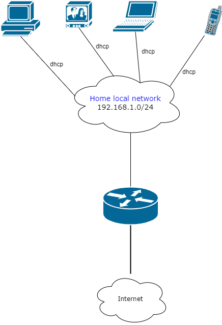

Выполнение [домашнего задания](https://github.com/netology-code/sysadm-homeworks/blob/devsys10/03-sysadmin-08-net/README.md) 
по теме "3.8. Компьютерные сети, лекция 3".

## Q/A

1. Подключитесь к публичному маршрутизатору в интернет. Найдите маршрут к вашему публичному IP

```shell
telnet route-views.routeviews.org
Trying 128.223.51.103...
Connected to route-views.routeviews.org.

<...>

User Access Verification

Username: rviews

route-views>show ip route 46.181.144.146
Routing entry for 46.180.0.0/15
  Known via "bgp 6447", distance 20, metric 0
  Tag 6939, type external
  Last update from 64.71.137.241 7w0d ago
  Routing Descriptor Blocks:
  * 64.71.137.241, from 64.71.137.241, 7w0d ago
      Route metric is 0, traffic share count is 1
      AS Hops 3
      Route tag 6939
      MPLS label: none

route-views>show bgp 46.181.144.146   
BGP routing table entry for 46.180.0.0/15, version 150820343
Paths: (23 available, best #22, table default)
  Not advertised to any peer
  Refresh Epoch 1
  3333 31133 39927, (aggregated by 65423 192.168.21.211)
    193.0.0.56 from 193.0.0.56 (193.0.0.56)
      Origin IGP, localpref 100, valid, external, atomic-aggregate
      path 7FE1040964D8 RPKI State not found
      rx pathid: 0, tx pathid: 0
  Refresh Epoch 1
  8283 1299 39927, (aggregated by 65423 192.168.21.136)
    94.142.247.3 from 94.142.247.3 (94.142.247.3)
      Origin IGP, metric 0, localpref 100, valid, external, atomic-aggregate
      Community: 1299:30000 8283:1 8283:101
      unknown transitive attribute: flag 0xE0 type 0x20 length 0x18
        value 0000 205B 0000 0000 0000 0001 0000 205B
              0000 0005 0000 0001 
      path 7FE0A25887D8 RPKI State not found
      rx pathid: 0, tx pathid: 0
  Refresh Epoch 1
  4901 6079 31133 39927, (aggregated by 65423 192.168.21.211)
    162.250.137.254 from 162.250.137.254 (162.250.137.254)
      Origin IGP, localpref 100, valid, external, atomic-aggregate
      Community: 65000:10100 65000:10300 65000:10400
      path 7FE154880220 RPKI State not found
      rx pathid: 0, tx pathid: 0
<...>
```

2. Создайте dummy0 интерфейс в Ubuntu. Добавьте несколько статических маршрутов. Проверьте таблицу маршрутизации.

Создание dummy-интерфейса:

```shell
echo "dummy" | sudo tee -a /etc/modules
sudo touch /etc/modprobe.d/dummy.conf
echo "options dummy numdummies=1" | sudo tee /etc/modprobe.d/dummy.conf
sudo ip link add dummy0 type dummy
```

Добавление маршрутов и вывод таблицы маршрутизации:

```shell
sudo ip route add 10.2.2.2/32 dev eth0
sudo ip route add 10.2.2.3/32 via 10.0.2.16
ip route
default via 10.0.2.2 dev eth0 proto dhcp src 10.0.2.15 metric 100 
10.0.2.0/24 dev eth0 proto kernel scope link src 10.0.2.15 
10.0.2.2 dev eth0 proto dhcp scope link src 10.0.2.15 metric 100 
10.2.2.2 dev eth0 scope link 
10.2.2.3 via 10.0.2.16 dev eth0
```

3. Проверьте открытые TCP порты в Ubuntu, какие протоколы и приложения используют эти порты? Приведите несколько примеров.

Для вывода открытых TCP-портов используем утилиту `ss` со следующими флагами:
* `-t` вывод только TCP-портов
* `-l` вывод портов в состоянии `LISTEN`, то есть открытые для прослушивания
* `-n` использовать числовое представление портов (например, `:ssh` -> `:22`)
* 

```shell
ss -tln
State                        Recv-Q                       Send-Q                                             Local Address:Port                                               Peer Address:Port                       Process                       
LISTEN                       0                            4096                                               127.0.0.53%lo:53                                                      0.0.0.0:*                                                        
LISTEN                       0                            128                                                      0.0.0.0:22                                                      0.0.0.0:*                                                        
LISTEN                       0                            128                                                         [::]:22                                                         [::]:*                                                                                
```

В данном случае открыты только порты для соединения по `ssh` (порты `:22`) и для [`systemd-resolved`](https://www.freedesktop.org/software/systemd/man/systemd-resolved.service.html) (порт `:53`).

4. Проверьте используемые UDP сокеты в Ubuntu, какие протоколы и приложения используют эти порты?

По аналогии с предыдущим заданием используем утилиту `ss`, заменив флаг `-t` на `-u`

```shell
ss -ulpn
State                        Recv-Q                       Send-Q                                              Local Address:Port                                              Peer Address:Port                       Process                       
UNCONN                       0                            0                                                   127.0.0.53%lo:53                                                     0.0.0.0:*                                                        
UNCONN                       0                            0                                                  10.0.2.15%eth0:68                                                     0.0.0.0:*
```

Порт `:53` предназначается для использования [`systemd-resolved`](https://www.freedesktop.org/software/systemd/man/systemd-resolved.service.html),
а порт `68` используется для получения информации о динамической IP-адресации от DHCP-сервера.

5. Используя diagrams.net, создайте L3 диаграмму вашей домашней сети или любой другой сети, с которой вы работали.

В качестве сети взята стандартная домашняя сеть с wi-fi-роутером.

Файл [network.xml](network.xml) для открытия в [diagrams.net](https://diagrams.net).



6. Установите Nginx, настройте в режиме балансировщика TCP или UDP.

Установка nginx:

```shell
sudo apt install nginx

sudo service nginx status
● nginx.service - A high performance web server and a reverse proxy server
     Loaded: loaded (/lib/systemd/system/nginx.service; enabled; vendor preset: enabled)
     Active: active (running) since Thu 2022-03-17 03:14:31 UTC; 24s ago
       Docs: man:nginx(8)
   Main PID: 1830 (nginx)
      Tasks: 3 (limit: 1107)
     Memory: 5.0M
     CGroup: /system.slice/nginx.service
             ├─1830 nginx: master process /usr/sbin/nginx -g daemon on; master_process on;
             ├─1831 nginx: worker process
             └─1832 nginx: worker process
```

Далее, определим, что есть два ip-адреса, на которые необходимо сделать проксирование и балансировку трафика:
* `10.2.2.2`
* `10.2.2.3`

Оба ip-адреса слушают следующие порты: `:25` - upd-трафик, `:80` - tcp-трафик.

Настроим nginx на прослушивание порта `:80` для обоих типов трафика с дальнейшей балансировкой и проксированием.

Добавим новый блок конфигурации в файл `/etc/nginx/nginx.conf`:

```
stream {
    upstream tcp_backend {
        server 10.2.2.2:80;
        server 10.2.2.3:80;
    }

    upstream upd_backend {
        server 10.2.2.2:25;
        server 10.2.2.3:25;
    }

    server {
        listen 80;
        proxy_pass tcp_backend;
    }

    server {
        listen 80 udp;
        proxy_pass upd_backend;
    }
}
```

Дополнительно, нужно убрать конфигурацию приветственной страницы, которая работает по умолчанию и слушает порт `80`:

```shell
sudo rm -f /etc/nginx/sites-enabled/default
```

Проверим, что конфигурация в порядке:

```shell
sudo nginx -t
nginx: the configuration file /etc/nginx/nginx.conf syntax is ok
nginx: configuration file /etc/nginx/nginx.conf test is successful
```

Затем нужно применить конфигурацию nginx

```shell
sudo nginx -s reload
sudo systemctl status nginx
● nginx.service - A high performance web server and a reverse proxy server
     Loaded: loaded (/lib/systemd/system/nginx.service; enabled; vendor preset: enabled)
     Active: active (running) since Mon 2022-03-21 03:37:24 UTC; 6s ago
       Docs: man:nginx(8)
    Process: 1364 ExecStartPre=/usr/sbin/nginx -t -q -g daemon on; master_process on; (code=exited, status=0/SUCCESS)
    Process: 1367 ExecStart=/usr/sbin/nginx -g daemon on; master_process on; (code=exited, status=0/SUCCESS)
   Main PID: 1376 (nginx)
      Tasks: 3 (limit: 1107)
     Memory: 3.3M
     CGroup: /system.slice/nginx.service
             ├─1376 nginx: master process /usr/sbin/nginx -g daemon on; master_process on;
             ├─1377 nginx: worker process
             └─1378 nginx: worker process
```

Проверим, что nginx принимает соединение на порт `80`

```shell
curl -v --max-time 5 http://localhost:80
*   Trying 127.0.0.1:80...
* TCP_NODELAY set
* Connected to localhost (127.0.0.1) port 80 (#0)
> GET / HTTP/1.1
> Host: localhost
> User-Agent: curl/7.68.0
> Accept: */*
> 
* Operation timed out after 5001 milliseconds with 0 bytes received
* Closing connection 0
curl: (28) Operation timed out after 5001 milliseconds with 0 bytes received
```

В данном случае добавили `--max-time 5`, чтобы быстрее получить ошибку, так как nginx пытается проксировать запрос на несуществующий адрес.
