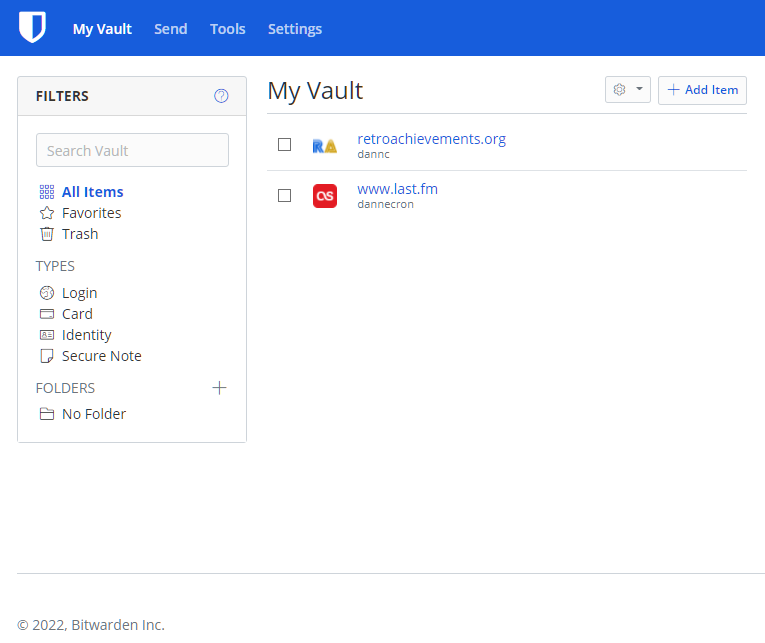
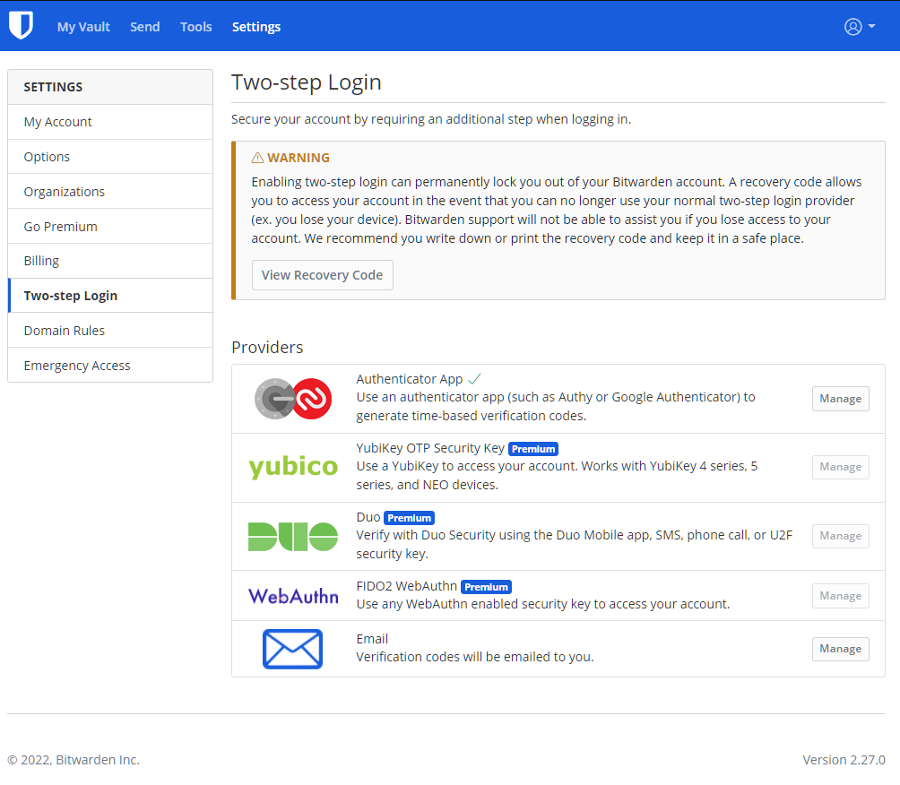
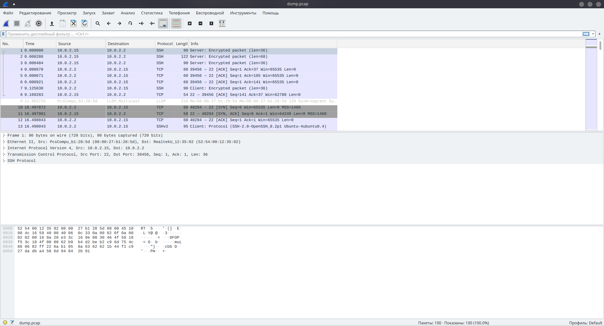

Выполнение [домашнего задания](https://github.com/netology-code/sysadm-homeworks/blob/devsys10/03-sysadmin-09-security/README.md) 
по теме "3.9. Элементы безопасности информационных систем".

## Q/A

1. Установите Bitwarden плагин для браузера. Зарегестрируйтесь и сохраните несколько паролей.



2. Установите Google authenticator на мобильный телефон. Настройте вход в Bitwarden акаунт через Google authenticator OTP.

Заместо `Google Authenticator` использовал приложение `Microsoft Authenticator`.



3. Установите apache2, сгенерируйте самоподписанный сертификат, настройте тестовый сайт для работы по HTTPS.

Вместо `apache2` будем производить настройку уже установленного в виртуальную машину `nginx` (установка производилась в [дз 3.8:6](/src/homework/03-sysadmin/3.8sysadmin/3.8/readme.md#Q/A)).

Первым шагом необходимо сгенерировать сертификат:

```shell
sudo openssl req -x509 -nodes -days 365 -newkey rsa:2048 \
  -keyout /etc/ssl/private/nginx-selfsigned.key \
  -out /etc/ssl/certs/nginx-selfsigned.crt \
  -subj "/C=RU/ST=Moscow/L=Moscow/O=Company Name/OU=Org/CN=site.localhost"

sudo ls -lah /etc/ssl/private/ | grep nginx
-rw------- 1 root root 1.7K Mar 28 03:01 nginx-selfsigned.key
  
sudo ls -lah /etc/ssl/certs/ | grep nginx
-rw-r--r-- 1 root root 1.4K Mar 28 03:01 nginx-selfsigned.crt
```

Воспользуемся [конфигуратором](https://ssl-config.mozilla.org/#server=nginx&version=1.17.7&config=modern&openssl=1.1.1k&guideline=5.6),
чтобы сгенерировать основу конфигурации для сервера. Получим следующую конфигурацию, которую расположим в файле `/etc/site-available/ssl`:

```
server {
    listen 443 ssl http2;
    listen [::]:443 ssl http2;
    server_name site.localhost;

    ssl_certificate /etc/ssl/certs/nginx-selfsigned.crt;
    ssl_certificate_key /etc/ssl/private/nginx-selfsigned.key;
    ssl_session_timeout 1d;
    ssl_session_cache shared:MozSSL:10m;  # about 40000 sessions
    ssl_session_tickets off;

    # modern configuration
    ssl_protocols TLSv1.3;
    ssl_prefer_server_ciphers off;

    # HSTS (ngx_http_headers_module is required) (63072000 seconds)
    add_header Strict-Transport-Security "max-age=63072000" always;

    # OCSP stapling
    ssl_stapling on;
    ssl_stapling_verify on;

    location / {
        root   /var/www/html;
        index  index.html index.htm;
    }
}
```

Переведём новую конфигурацию в боевые настройки и проверим, что всё в порядке:

```shell
sudo ln -s /etc/nginx/sites-available/ssl /etc/nginx/sites-enabled/ssl.conf

sudo nginx -t
nginx: [warn] "ssl_stapling" ignored, issuer certificate not found for certificate "/etc/ssl/certs/nginx-selfsigned.crt"
nginx: the configuration file /etc/nginx/nginx.conf syntax is ok
nginx: configuration file /etc/nginx/nginx.conf test is successful
```

Перезапускаем сервис `nginx`, проверяем его состояние:

```shell
sudo service nginx reload
sudo service nginx status
service nginx status
● nginx.service - A high performance web server and a reverse proxy server
     Loaded: loaded (/lib/systemd/system/nginx.service; enabled; vendor preset: enabled)
     Active: active (running) since Mon 2022-03-28 02:53:00 UTC; 21min ago
       Docs: man:nginx(8)
    Process: 2256 ExecReload=/usr/sbin/nginx -g daemon on; master_process on; -s reload (code=exited, status=0/SUCCESS)
   Main PID: 736 (nginx)
      Tasks: 3 (limit: 1107)
     Memory: 13.3M
     CGroup: /system.slice/nginx.service
             ├─ 736 nginx: master process /usr/sbin/nginx -g daemon on; master_process on;
             ├─2257 nginx: worker process
             └─2258 nginx: worker process
```

При помощи `curl`, убедимся, что сервер работает корректно:

```shell
curl https://site.localhost --resolve 'site.localhost:127.0.0.1'
curl: (60) SSL certificate problem: self signed certificate

# проигнорируем ошибки самоподписного сертификата
curl -k https://site.localhost --resolve 'site.localhost:127.0.0.1'
<!DOCTYPE html>
<html>
<head>
<title>Welcome to nginx!</title>
<style>
    body {
        width: 35em;
        margin: 0 auto;
        font-family: Tahoma, Verdana, Arial, sans-serif;
    }
</style>
</head>
<body>
<h1>Welcome to nginx!</h1>
<p>If you see this page, the nginx web server is successfully installed and
working. Further configuration is required.</p>

<p>For online documentation and support please refer to
<a href="http://nginx.org/">nginx.org</a>.<br/>
Commercial support is available at
<a href="http://nginx.com/">nginx.com</a>.</p>

<p><em>Thank you for using nginx.</em></p>
</body>
</html>
```

4. Проверьте на TLS уязвимости произвольный сайт в интернете

```shell
git clone --depth 1 https://github.com/drwetter/testssl.sh.git
cd testssl
./testssl.sh -U --sneaky https://metagamerscore.com

 Start 2022-03-28 10:31:09        -->> 217.61.246.126:443 (metagamerscore.com) <<--

 rDNS (217.61.246.126):  --
 Service detected:       HTTP


 Testing vulnerabilities 

 Heartbleed (CVE-2014-0160)                not vulnerable (OK), no heartbeat extension
 CCS (CVE-2014-0224)                       not vulnerable (OK)
 Ticketbleed (CVE-2016-9244), experiment.  not vulnerable (OK)
 ROBOT                                     Server does not support any cipher suites that use RSA key transport
 Secure Renegotiation (RFC 5746)           supported (OK)
 Secure Client-Initiated Renegotiation     not vulnerable (OK)
 CRIME, TLS (CVE-2012-4929)                not vulnerable (OK)
 BREACH (CVE-2013-3587)                    potentially NOT ok, "gzip" HTTP compression detected. - only supplied "/" tested
                                           Can be ignored for static pages or if no secrets in the page
 POODLE, SSL (CVE-2014-3566)               not vulnerable (OK)
 TLS_FALLBACK_SCSV (RFC 7507)              No fallback possible (OK), no protocol below TLS 1.2 offered
 SWEET32 (CVE-2016-2183, CVE-2016-6329)    not vulnerable (OK)
 FREAK (CVE-2015-0204)                     not vulnerable (OK)
 DROWN (CVE-2016-0800, CVE-2016-0703)      not vulnerable on this host and port (OK)
                                           make sure you don't use this certificate elsewhere with SSLv2 enabled services
                                           https://censys.io/ipv4?q=DA0C37574C249C089F819CDC857AFDD834D0ADA90888D97A0B81071AB288732E could help you to find out
 LOGJAM (CVE-2015-4000), experimental      not vulnerable (OK): no DH EXPORT ciphers, no DH key detected with <= TLS 1.2
 BEAST (CVE-2011-3389)                     not vulnerable (OK), no SSL3 or TLS1
 LUCKY13 (CVE-2013-0169), experimental     not vulnerable (OK)
 Winshock (CVE-2014-6321), experimental    not vulnerable (OK)
 RC4 (CVE-2013-2566, CVE-2015-2808)        no RC4 ciphers detected (OK)


 Done 2022-03-28 10:31:34 [  27s] -->> 217.61.246.126:443 (metagamerscore.com) <<--
```

5. Установите на Ubuntu ssh сервер, сгенерируйте новый приватный ключ. Скопируйте свой публичный ключ на другой сервер. Подключитесь к серверу по SSH-ключу.

На виртуальной машине уже установлен ssh-сервер и настроен один ssh-ключ для подключения к машине с хоста.
Таким образом сгенерируем новый ssh-ключ для пользователя `vagrant` и попробуем подключиться как пользователь `root` через ssh-сервер.

Генерация приватного и открытого ssh-ключей:

```shell
ssh-keygen
Generating public/private rsa key pair.
Enter file in which to save the key (/home/vagrant/.ssh/id_rsa): 
Enter passphrase (empty for no passphrase): 
Enter same passphrase again: 
Your identification has been saved in /home/vagrant/.ssh/id_rsa
Your public key has been saved in /home/vagrant/.ssh/id_rsa.pub
The key fingerprint is:
SHA256:id08L1eU83CEIr5iolPo2NKg+J7palNIO0o7D7agGuU vagrant@vagrant
The key's randomart image is:
+---[RSA 3072]----+
|               ..|
|          . . .o |
|         . . .= .|
| .     o +.  . = |
|. +  .. S +.  . .|
| B... o o .o .   |
|*+E* o o .. o    |
|B*=o*      o     |
|**Xo .           |
+----[SHA256]-----+
```

Добавим открытый ключ в файл `authorized_keys` для пользователя `root`:

```shell
cat .ssh/id_rsa.pub | sudo tee /root/.ssh/authorized_keys
```

Проверим, что всё работает:
```shell
ssh -l root 127.0.0.1
Welcome to Ubuntu 20.04.4 LTS (GNU/Linux 5.4.0-104-generic x86_64)
<...>
root@vagrant:~#
```

6. Переименуйте файлы ключей из задания 5. Настройте файл конфигурации SSH клиента, так чтобы вход на удаленный сервер осуществлялся по имени сервера.

```shell
mv ~/.ssh/id_rsa ~/.ssh/localhost_key
mv ~/.ssh/id_rsa.pub ~/.ssh/localhost_key.pub
```

Добавим новую конфигурацию в файл `~/.ssh/config`:

```
host local-root
  hostname 127.0.0.1
  user root
  identityfile ~/.ssh/localhost_key
```

Проверим, что всё работает:
```shell
ssh local-root
Welcome to Ubuntu 20.04.4 LTS (GNU/Linux 5.4.0-104-generic x86_64)
<...>
root@vagrant:~#
```

7. Соберите дамп трафика утилитой tcpdump в формате pcap, 100 пакетов. Откройте файл pcap в Wireshark.

```shell
sudo tcpdump -c 100 -w dump.pcap

tcpdump -r dump.pcap 
reading from file dump.pcap, link-type EN10MB (Ethernet)
<...>
```

Для просмотра полученного файла в `Wireshark`, установим утилиту на хосте:

```shell
sudo apt install wireshark
```

Теперь, скопируем файл из виртуальной машины на хост, чтобы была возможность открыть его без проблем:

```shell
scp -P 2222 vagrant@127.0.0.1:/home/vagrant/dump.pcap ./dump.pcap
```

Затем запустим графическое отображение утилиты и откроем в ней файл:


