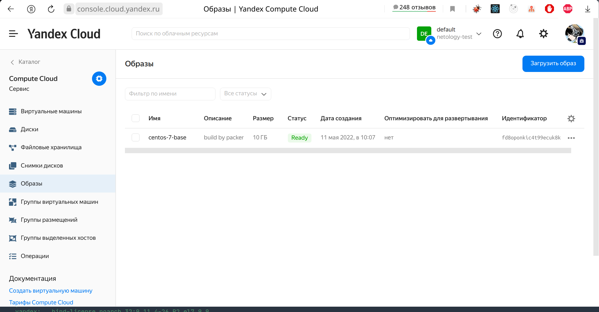
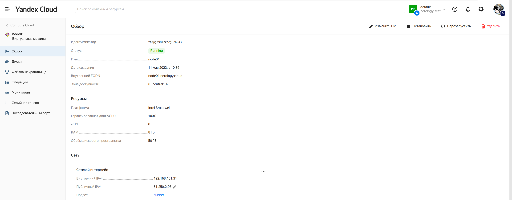
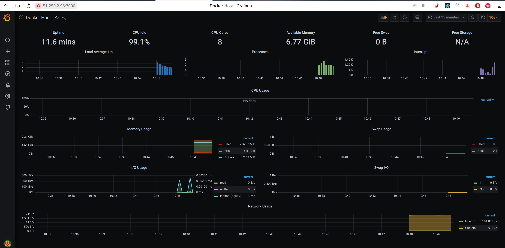

Выполнение [домашнего задания](https://github.com/netology-code/virt-homeworks/blob/virt-11/05-virt-04-docker-compose/README.md) 
по теме "5.4. Оркестрация группой Docker контейнеров на примере Docker Compose".

## Q/A

### Задача 1

> Создать собственный образ операционной системы с помощью Packer.
>
> Для получения зачета, вам необходимо предоставить:
> - Скриншот страницы, как на слайде из презентации (слайд 37).

Пошаговая инструкция работы с yandex-облаком:
1. Установка `yc`: `curl -sSL https://storage.yandexcloud.net/yandexcloud-yc/install.sh | bash`
2. Инициализация конфигурации: `yc init`
3. Проверка, что всё работает:
   ```shell
   yc compute image list
   +----+------+--------+-------------+--------+
   | ID | NAME | FAMILY | PRODUCT IDS | STATUS |
   +----+------+--------+-------------+--------+
   +----+------+--------+-------------+--------+
   ```
4. Создание сети: `yc vpc network create --name net`
5. Создание подсети: `yc vpc subnet create --name my-subnet-a --zone ru-central1-a --range 10.1.2.0/24 --network-name net --description "test subnet for test net"`
6. Копирование примера конфигурации packer [centos-7-base.example.json](./packer/centos-7-base.example.json) в `centos-7-base.json`.
7. Затем нужно заполнить недостающие поля в конфигурации.
8. Запуск валидации конфигурации
   ```shell
   packer validate packer/centos-7-base.json
   The configuration is valid.
   ```
9. Запуск сборки образа `packer build packer/centos-7-base.json`
10. Удаление подсети: `yc vpc subnet delete --name my-subnet-a`
11. Удаление сети: `yc vpc network delete --name net`

**Результат**:



### Задача 2

> Создать вашу первую виртуальную машину в Яндекс.Облаке.
>
> Для получения зачета, вам необходимо предоставить:
> - Скриншот страницы свойств созданной ВМ

1. Копирование секретов для `terraform` из [variables.tf.example](./terraform/variables.tf.example) в `variables.tf`
2. Затем нужно изменить поля в конфигурации.
3. Инициализировать конфигурацию: `terraform init` (не работает без vpn, при получении данных отдаётся 403 статус код)
4. Просмотреть конфигурацию `terraform plan`
5. Применить конфигурацию к облаку `terraform apply -auto-approve`

**Результат**:



### Задача 3

> Создать ваш первый готовый к боевой эксплуатации компонент мониторинга, состоящий из стека микросервисов.
>
> Для получения зачета, вам необходимо предоставить:
> - Скриншот работающего веб-интерфейса Grafana с текущими метриками

1. Копирование inventory файла для `ansible` из [inventory.example](./ansible/inventory.example) в `inventory`
2. Запуск `ansible`: `cd ansible && ansible-playbook provision.yml`

**Результат**:



### Clean up

Удаление всей инфраструктуры:

1. Удаление ВМ, сетей: `terraform destroy -auto-approve`
2. Удаление образа ОС: `yc compute image delete --id fd8oponkic4t99ecuk8k`