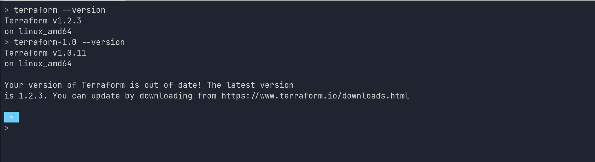

Выполнение [домашнего задания](https://github.com/netology-code/virt-homeworks/blob/master/07-terraform-01-intro/README.md)
по теме "7.1. Инфраструктура как код".

## Q/A

### Задание 1

> #### Легенда
> 
> Через час совещание на котором менеджер расскажет о новом проекте. Начать работу над которым надо будет уже сегодня.
> На данный момент известно, что это будет сервис, который ваша компания будет предоставлять внешним заказчикам.
> Первое время, скорее всего, будет один внешний клиент, со временем внешних клиентов станет больше.
> 
> Так же по разговорам в компании есть вероятность, что техническое задание еще не четкое, что приведет к большому
> количеству небольших релизов, тестирований интеграций, откатов, доработок, то есть скучно не будет.
> 
> Вам, как девопс инженеру, будет необходимо принять решение об инструментах для организации инфраструктуры.
> На данный момент в вашей компании уже используются следующие инструменты:
> - остатки Сloud Formation,
> - некоторые образы сделаны при помощи Packer,
> - год назад начали активно использовать Terraform,
> - разработчики привыкли использовать Docker,
> - уже есть большая база Kubernetes конфигураций,
> - для автоматизации процессов используется Teamcity,
> - также есть совсем немного Ansible скриптов,
> - и ряд bash скриптов для упрощения рутинных задач.
> 
> Для этого в рамках совещания надо будет выяснить подробности о проекте, что бы в итоге определиться с инструментами:
> 
> 1. Какой тип инфраструктуры будем использовать для этого проекта: изменяемый или не изменяемый?
> 1. Будет ли центральный сервер для управления инфраструктурой?
> 1. Будут ли агенты на серверах?
> 1. Будут ли использованы средства для управления конфигурацией или инициализации ресурсов?
> 
> В связи с тем, что проект стартует уже сегодня, в рамках совещания надо будет определиться со всеми этими вопросами.
> 
> #### В результате задачи необходимо
> 
> 1. Ответить на четыре вопроса представленных в разделе "Легенда".
> 1. Какие инструменты из уже используемых вы хотели бы использовать для нового проекта?
> 1. Хотите ли рассмотреть возможность внедрения новых инструментов для этого проекта?
> 
> Если для ответа на эти вопросы недостаточно информации, то напишите какие моменты уточните на совещании.

* Ответить на четыре вопроса представленных в разделе "Легенда".
    1. Какой тип инфраструктуры будем использовать для этого проекта: изменяемый или не изменяемый?
       
        Для ответа на данный вопрос недостаточно данных о требованиях к новому проекту со стороны безопасности.
        Если на совещании можно это выяснить, то будет два варианта: если требования к безопасности выставляются в рамках расширенных требований по типу `PCI DSS`,
        то будет использоваться не изменяемый тип инфраструктуры, иначе - изменяемый.
    
    2. Будет ли центральный сервер для управления инфраструктурой?
    
        Так как на текущий момент в инфраструктуре компании не используются решения на базе центрального сервера 
        для управления инфраструктурой, то внедрять данное решение смысла нет. Ответ: нет.
    
    3. Будут ли агенты на серверах?
    
        Ответ вытекает из предыдущего вопроса. Если в новом проекте не используется центральный сервер управления,
        то и в использовании агентов нет необходимости. Ответ: нет.

    4. Будут ли использованы средства для управления конфигурацией или инициализации ресурсов?
        
        Да, средства будут использованы, так как планируется расширение и необходимо будет разворачивать инфраструктуру 
        для каждого нового внешнего клиента. Плюс, скорее всего, будет необходимость реплицирования
        и горизонтального расширения сервисов в рамках существующей инфраструктуры.
        

* Какие инструменты из уже используемых вы хотели бы использовать для нового проекта?

  Точно стоит использовать `terraform` как средство инициализации ресурсов в совокупности с `ansible`.
  Для стандартизации образов виртуальных машин стоит использовать `packer`.
  Так как в разработке принято использовать образы `docker`, то для построения инфраструктуры можно задуматься
  над использованием `kubernetes`.
  
  В данном случае стоит рассмотреть переход от bash-скриптов к плагинам `ansible` для автоматизации.
  Либо перенос скриптов на другой, более поддерживаемый и принятый в компании скриптовый язык программирования.

* Хотите ли рассмотреть возможность внедрения новых инструментов для этого проекта?
  
  В текущем стеке собраны все инструменты, которые представляют собой best-practice в построении инфраструктуры.
  Дополнительно, увеличение количества используемых инструментов ведёт к "распылению" знаний, а значит невозможности
  проведения более глубокой оптимизации процессов для достижения главной цели - уменьшения TTM.

### Задание 2

> Официальный сайт: https://www.terraform.io/
> 
> Установите терраформ при помощи менеджера пакетов используемого в вашей операционной системе.
> В виде результата этой задачи приложите вывод команды `terraform --version`.

```shell
terraform --version
Terraform v1.2.3
on linux_amd64
```

## Задача 3. Поддержка легаси кода.

> В какой-то момент вы обновили терраформ до новой версии, например с 0.12 до 0.13.
> А код одного из проектов настолько устарел, что не может работать с версией 0.13.
> В связи с этим необходимо сделать так, чтобы вы могли одновременно использовать последнюю версию терраформа установленную при помощи
> штатного менеджера пакетов и устаревшую версию 0.12.
> 
> В виде результата этой задачи приложите вывод `--version` двух версий терраформа доступных на вашем компьютере
> или виртуальной машине.

Для примера были взяты актуальная версия `1.2.3` и последняя доступная на официальном сайте версия из линейки `1.0.x`: `1.0.11`.
Другие версии можно собрать из [source codes](https://github.com/hashicorp/terraform).


