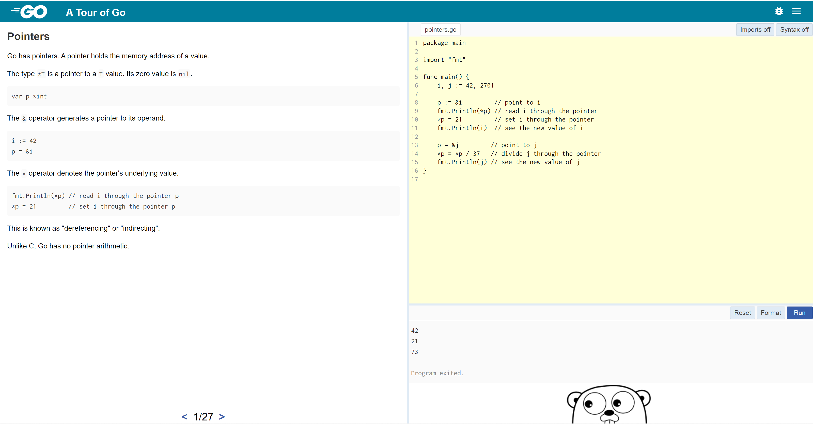

Выполнение [домашнего задания](https://github.com/netology-code/virt-homeworks/blob/master/07-terraform-05-golang/README.md)
по теме "7.5. Основы golang".

## Q/A

### Задание 1

> Установите golang
> 
> 1. Воспользуйтесь инструкций с официального сайта: [https://golang.org/](https://golang.org/).
> 2. Так же для тестирования кода можно использовать песочницу: [https://play.golang.org/](https://play.golang.org/).

```shell
go version
go version go1.18.3 linux/amd64
```

### Задание 2

> Знакомство с gotour.
> 
> У Golang есть обучающая интерактивная консоль [https://tour.golang.org/](https://tour.golang.org/).
> Рекомендуется изучить максимальное количество примеров. В консоли уже написан необходимый код,
> осталось только с ним ознакомиться и поэкспериментировать как написано в инструкции в левой части экрана.



### Задание 3

> Написание кода
> 
> Цель этого задания закрепить знания о базовом синтаксисе языка. Можно использовать редактор кода
> на своем компьютере, либо использовать песочницу: [https://play.golang.org/](https://play.golang.org/).
> 
> 1. Напишите программу для перевода метров в футы (1 фут = 0.3048 метр). Можно запросить исходные данные
> у пользователя, а можно статически задать в коде.
> Для взаимодействия с пользователем можно использовать функцию `Scanf`:
>     ```go
>     package main
>     
>     import "fmt"
>     
>     func main() {
>         fmt.Print("Enter a number: ")
>         var input float64
>         fmt.Scanf("%f", &input)
>     
>         output := input * 2
>     
>         fmt.Println(output)    
>     }
>     ```
> 
> 1. Напишите программу, которая найдет наименьший элемент в любом заданном списке, например:
>    ```
>    x := []int{48,96,86,68,57,82,63,70,37,34,83,27,19,97,9,17,}
>    ```
> 1. Напишите программу, которая выводит числа от 1 до 100, которые делятся на 3. То есть `(3, 6, 9, …)`.
> 
> В виде решения ссылку на код или сам код.

1. Программа для перевода метров в футы: [meters_to_feet.go](./golang/tasks/meters_to_feet.go).
2. Программа для нахождения наименьшего элемента в списке: [min_element.go](./golang/tasks/min_element.go)
3. Программа для вывода чисел, которые деляться на 3: [div_three.go](./golang/tasks/div_three.go)

Для запуска программ нужно проделать следующие шаги:

1. Перейти в директорию [golang](./golang/)
    ```shell
	cd golang
	```
1. Запустить программу:
	```shell
	go run main.go
	```
1. Ввести в консоль число от 1 до 3, в зависимости от необходимой программы

### Задание 4

> Протестировать код
>
> Создайте тесты для функций из предыдущего задания.

Написал тесты для [программы 1: meters_to_feet](./golang/tasks/meters_to_feet_test.go) и [программы 2: min_element](./golang/tasks/min_element_test.go).

Запуск тестов:

```shell
cd golang/tasks
go test
PASS
ok      main/tasks      0.003s
```
