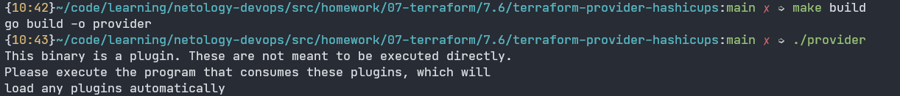

Выполнение [домашнего задания](https://github.com/netology-code/virt-homeworks/blob/master/07-terraform-06-providers/README.md)
по теме "7.6. Написание собственных провайдеров для Terraform".

## Q/A

### Задание 1

> Давайте потренируемся читать исходный код AWS провайдера, который можно склонировать от сюда:
> [https://github.com/hashicorp/terraform-provider-aws.git](https://github.com/hashicorp/terraform-provider-aws.git).
> Просто найдите нужные ресурсы в исходном коде и ответы на вопросы станут понятны.
>
> 1. Найдите, где перечислены все доступные `resource` и `data_source`, приложите ссылку на эти строки в коде на
> гитхабе.
> 1. Для создания очереди сообщений SQS используется ресурс `aws_sqs_queue` у которого есть параметр `name`.
>     * С каким другим параметром конфликтует `name`? Приложите строчку кода, в которой это указано.
>     * Какая максимальная длина имени?
>     * Какому регулярному выражению должно подчиняться имя? 

Все возможные значения `resource` перечислены в файле [internal/provider/provider.go](https://github.com/hashicorp/terraform-provider-aws/blob/main/internal/provider/provider.go#L916) в ключе `ResourcesMap`.

Все возможные значения `data_source` перечислены в файле [internal/provider/provider.go](https://github.com/hashicorp/terraform-provider-aws/blob/main/internal/provider/provider.go#L425) в ключе `DataSourcesMap`.

В ресурсе [`aws_sqs_queue`](https://github.com/hashicorp/terraform-provider-aws/blob/87b2ab2a3c0b420f84a3942664205109dbcde609/internal/service/sqs/queue.go):
* параметр `name` [конфликтует с параметром `name_prefix`](https://github.com/hashicorp/terraform-provider-aws/blob/87b2ab2a3c0b420f84a3942664205109dbcde609/internal/service/sqs/queue.go#L87)
* максимальная длина имени очереди: 75 символов для fifo и 80 символов для остальных
* регулярное выражение для имени очереди:
  * тип fifo: [`^[a-zA-Z0-9_-]{1,75}\.fifo$`](https://github.com/hashicorp/terraform-provider-aws/blob/87b2ab2a3c0b420f84a3942664205109dbcde609/internal/service/sqs/queue.go#L425)
  * другие очереди: [`^[a-zA-Z0-9_-]{1,80}$`](https://github.com/hashicorp/terraform-provider-aws/blob/87b2ab2a3c0b420f84a3942664205109dbcde609/internal/service/sqs/queue.go#L427)

### Задание 2

> В рамках вебинара и презентации мы разобрали как создать свой собственный провайдер на примере кофемашины.
> Также вот официальная документация о создании провайдера:
> [https://learn.hashicorp.com/collections/terraform/providers](https://learn.hashicorp.com/collections/terraform/providers).
> 
> 1. Проделайте все шаги создания провайдера.
> 2. В виде результата приложение ссылку на исходный код.
> 3. Попробуйте скомпилировать провайдер, если получится то приложите снимок экрана с командой и результатом компиляции.  

Ссылка на исходный код провайдера [terraform-provider-hashicups](./terraform-provider-hasicups).

Скриншот компиляции провайдера:

