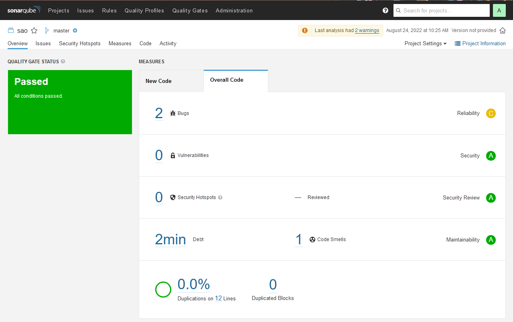

Выполнение [домашнего задания](https://github.com/netology-code/mnt-homeworks/blob/MNT-13/09-ci-03-cicd/README.md)
по теме "9.3. CI\CD".

## Q/A

### Задание 1

> Подготовка к выполнению
> 1. Создаём 2 VM в yandex cloud со следующими параметрами: 2CPU 4RAM Centos7(остальное по минимальным требованиям)
> 2. Прописываем в [inventory](./infrastructure/inventory/hosts.yml) [playbook'a](./infrastructure/site.yml) созданные хосты
> 3. Добавляем в [files](./infrastructure/files/) файл со своим публичным ключом (id_rsa.pub). Если ключ называется иначе - найдите таску в плейбуке, которая использует id_rsa.pub имя и исправьте на своё
> 4. Запускаем playbook, ожидаем успешного завершения

```shell
ansible-playbook -i inventory/hosts.yml site.yml
```


```text
<...>
PLAY RECAP *****************************************************************************************************************
nexus-01                   : ok=17   changed=15   unreachable=0    failed=0    skipped=2    rescued=0    ignored=0
sonar-01                   : ok=35   changed=27   unreachable=0    failed=0    skipped=0    rescued=0    ignored=0
```

> 5. Проверяем готовность Sonarqube через [браузер](http://localhost:9000)
> 6. Заходим под admin\admin, меняем пароль на свой


> 7.  Проверяем готовность Nexus через [бразуер](http://localhost:8081)
> 8. Подключаемся под admin\admin123, меняем пароль, сохраняем анонимный доступ


### Задание 2

> Знакомство с SonarQube

> 1. Создаём новый проект, название произвольное
> 2. Скачиваем пакет sonar-scanner, который нам предлагает скачать сам sonarqube

Для скачивания пакета актуальной версии на текущий момент:

```shell
curl https://binaries.sonarsource.com/Distribution/sonar-scanner-cli/sonar-scanner-cli-4.7.0.2747-linux.zip -o sonar-scanner-cli-4.7.0.2747-linux.zip
```

Затем нужно распаковать архив в любую директорию:

```shell
unzip sonar-scanner-cli-4.7.0.2747-linux.zip -d ~/.local/share/
```

Внутри распакованной директории будет находиться директория `bin`, которую и нужно добавить в `$PATH`.

> 3. Делаем так, чтобы binary был доступен через вызов в shell (или меняем переменную PATH или любой другой удобный вам способ)
> 4. Проверяем `sonar-scanner --version`

```shell
sonar-scanner --version
```

```text
INFO: Scanner configuration file: ~/.local/share/sonar-scanner/conf/sonar-scanner.properties
INFO: Project root configuration file: NONE
INFO: SonarScanner 4.7.0.2747
INFO: Java 11.0.14.1 Eclipse Adoptium (64-bit)
INFO: Linux 5.10.102.1-microsoft-standard-WSL2 amd64
```

> 5. Запускаем анализатор против кода из директории [example](./example) с дополнительным ключом `-Dsonar.coverage.exclusions=fail.py`

```shell
sonar-scanner \
  -Dsonar.projectKey=sao \
  -Dsonar.sources=. \
  -Dsonar.host.url=http://<sonar-01>:9000 \
  -Dsonar.login=<token> \
  -Dsonar.coverage.exclusions=fail.py
```

```text
<...>
INFO: ------------------------------------------------------------------------
INFO: EXECUTION SUCCESS
INFO: ------------------------------------------------------------------------
INFO: Total time: 34.848s
INFO: Final Memory: 8M/37M
INFO: ------------------------------------------------------------------------
```

> 6. Смотрим результат в интерфейсе



> 7. Исправляем ошибки, которые он выявил(включая warnings)

Исправляем функцию, чтобы она выглядела следующим образом:

```python
def increment(index):
    newIndex = index+1
    return newIndex
```

И убираем из функции `print_numb` конструкцию `pass`.

> 8. Запускаем анализатор повторно - проверяем, что QG пройдены успешно
> 9. Делаем скриншот успешного прохождения анализа, прикладываем к решению ДЗ


### Задание 3

> Знакомство с Nexus
> 1. В репозиторий `maven-releases` загружаем артефакт с GAV параметрами:
>     1. groupId: netology
>     2. artifactId: java
>     3. version: 8_282
>     4. classifier: distrib
>     5. type: tar.gz


> 2. В него же загружаем такой же артефакт, но с version: 8_102
> 3. Проверяем, что все файлы загрузились успешно


> 4. В ответе присылаем файл `maven-metadata.xml` для этого артефекта

```xml
<metadata modelVersion="1.1.0">
    <groupId>netology</groupId>
    <artifactId>java</artifactId>
    <versioning>
        <latest>8_282</latest>
        <release>8_282</release>
        <versions>
            <version>8_102</version>
            <version>8_282</version>
        </versions>
        <lastUpdated>20220824033600</lastUpdated>
    </versioning>
</metadata>
```

### Задание 4

> Знакомство с Maven
> 
> Подготовка к выполнению
> 1. Скачиваем дистрибутив с [maven](https://maven.apache.org/download.cgi)
> 2. Разархивируем, делаем так, чтобы binary был доступен через вызов в shell (или меняем переменную PATH или любой другой удобный вам способ)

Делать нужно по аналогии с `sonar-scanner` из [Задания 2](#задание-2)

> 3. Удаляем из `apache-maven-<version>/conf/settings.xml` упоминание о правиле, отвергающем http соединение( раздел `mirrors->id`: `my-repository-http-blocker`)
> 4. Проверяем `mvn --version`

```shell
mvn --version
```

```text
Apache Maven 3.8.6 (84538c9988a25aec085021c365c560670ad80f63)
Maven home: ~/downloads/apache-maven-3.8.6
Java version: 11.0.16, vendor: Ubuntu, runtime: /usr/lib/jvm/java-11-openjdk-amd64
Default locale: en, platform encoding: UTF-8
OS name: "linux", version: "5.10.102.1-microsoft-standard-wsl2", arch: "amd64", family: "unix"
```

> 5. Забираем директорию [mvn](./mvn) с pom

> Основная часть
> 1. Меняем в `pom.xml` блок с зависимостями под наш артефакт из первого пункта задания для Nexus (java с версией 8_282)
> 2. Запускаем команду `mvn package` в директории с `pom.xml`, ожидаем успешного окончания

```shell
mvn package
```

```text
[INFO] Building jar: ./mvn/target/simple-app-1.0-SNAPSHOT.jar
[INFO] ------------------------------------------------------------------------
[INFO] BUILD SUCCESS
[INFO] ------------------------------------------------------------------------
[INFO] Total time:  29.857 s
[INFO] Finished at: 2022-08-24T10:51:41+07:00
[INFO] ------------------------------------------------------------------------
```

> 3. Проверяем директорию `~/.m2/repository/`, находим наш артефакт

```shell
ls -la ~/.m2/repository/netology/java/8_282
```

```text
total 24
drwxr-xr-x 2 dannc dannc 4096 Aug 24 10:51 .
drwxr-xr-x 3 dannc dannc 4096 Aug 24 10:51 ..
-rw-r--r-- 1 dannc dannc  176 Aug 24 10:51 _remote.repositories
-rw-r--r-- 1 dannc dannc  258 Aug 24 10:51 java-8_282-distrib.tar.gz
-rw-r--r-- 1 dannc dannc   40 Aug 24 10:51 java-8_282-distrib.tar.gz.sha1
-rw-r--r-- 1 dannc dannc  397 Aug 24 10:51 java-8_282.pom.lastUpdated
```

> 4. В ответе присылаем исправленный файл `pom.xml`

```xml
<project 
    xmlns="http://maven.apache.org/POM/4.0.0"
    xmlns:xsi="http://www.w3.org/2001/XMLSchema-instance"
    xsi:schemaLocation="http://maven.apache.org/POM/4.0.0 http://maven.apache.org/xsd/maven-4.0.0.xsd"
>
    <modelVersion>4.0.0</modelVersion>

    <groupId>com.netology.app</groupId>
    <artifactId>simple-app</artifactId>
    <version>1.0-SNAPSHOT</version>
    <repositories>
        <repository>
            <id>my-repo</id>
            <name>maven-releases</name>
            <url>http://nexus-01:8081/repository/maven-releases/</url>
        </repository>
    </repositories>
    <dependencies>
        <dependency>
          <groupId>netology</groupId>
          <artifactId>java</artifactId>
          <version>8_282</version>
          <classifier>distrib</classifier>
          <type>tar.gz</type>
        </dependency>
    </dependencies>
</project>
```
