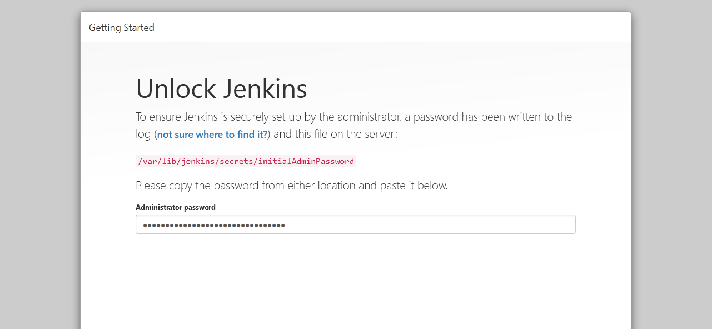
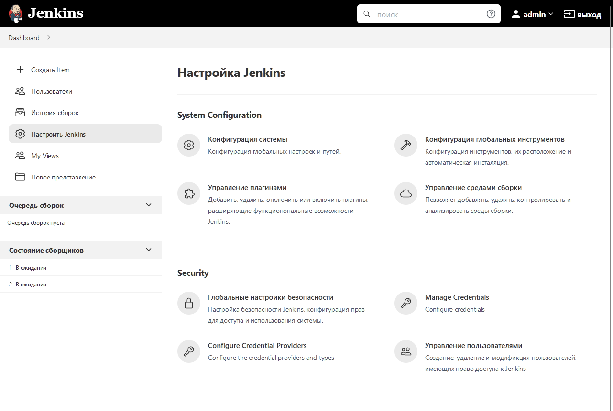

Выполнение [домашнего задания](https://github.com/netology-code/mnt-homeworks/blob/MNT-13/09-ci-04-jenkins/README.md)
по теме "9.3. Jenkins".

## Q/A

### Задание 1

> Подготовка к выполнению
> 
> 1. Создать 2 VM: для jenkins-master и jenkins-agent.
> 2. Установить jenkins при помощи playbook'a.
> 3. Запустить и проверить работоспособность.
> 4. Сделать первоначальную настройку.

[Playbook](./infrastructure/site.yml) для установки `jenkins`. Были сделаны следующие доработки в сравнении
с оригинальным `playbook`:
- На мастере и агенте `github.com` добавлен в `known_hosts` пользователя `jenkins`
- На агенте установлен `python3.8` из исходников
- Добавлена установка `molecule`

Запуск:

```shell
ansible-playbook -i inventory/hosts.yml site.yml
```

```text
<...>
PLAY RECAP *********************************************************************************************
jenkins-agent-01           : ok=18   changed=15   unreachable=0    failed=0    skipped=0    rescued=0    ignored=0
jenkins-master-01          : ok=11   changed=9    unreachable=0    failed=0    skipped=0    rescued=0    ignored=0
```



После первоначальной настройки будет выведен dashboard с настройками `jenkins`:


// todo описать отключение master от сборок
// todo описать подключение agent к сборкам

### Задание 2

> Основная часть
> 
> 1. Сделать Freestyle Job, который будет запускать `molecule test` из любого вашего репозитория с ролью.

В качестве репозитория для запуска тестов будет использован [netology-devops-ansible-vector](https://github.com/Dannecron/netology-devops-ansible-vector).


> 2. Сделать Declarative Pipeline Job, который будет запускать `molecule test` из любого вашего репозитория с ролью.
> 3. Перенести Declarative Pipeline в репозиторий в файл `Jenkinsfile`.
> 4. Создать Multibranch Pipeline на запуск `Jenkinsfile` из репозитория.
> 5. Создать Scripted Pipeline, наполнить его скриптом из [pipeline](./pipeline).
> 6. Внести необходимые изменения, чтобы Pipeline запускал `ansible-playbook` без флагов `--check --diff`, если не установлен параметр при запуске джобы (prod_run = True), по умолчанию параметр имеет значение False и запускает прогон с флагами `--check --diff`.
> 7. Проверить работоспособность, исправить ошибки, исправленный Pipeline вложить в репозиторий в файл `ScriptedJenkinsfile`.
> 8. Отправить ссылку на репозиторий с ролью и Declarative Pipeline и Scripted Pipeline.
