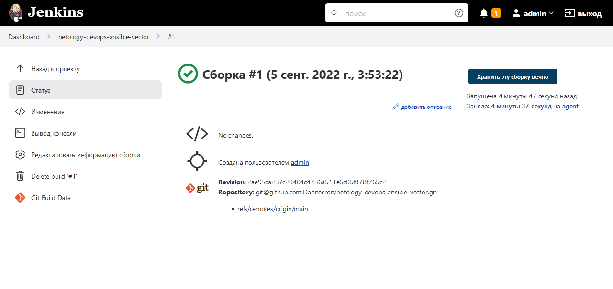
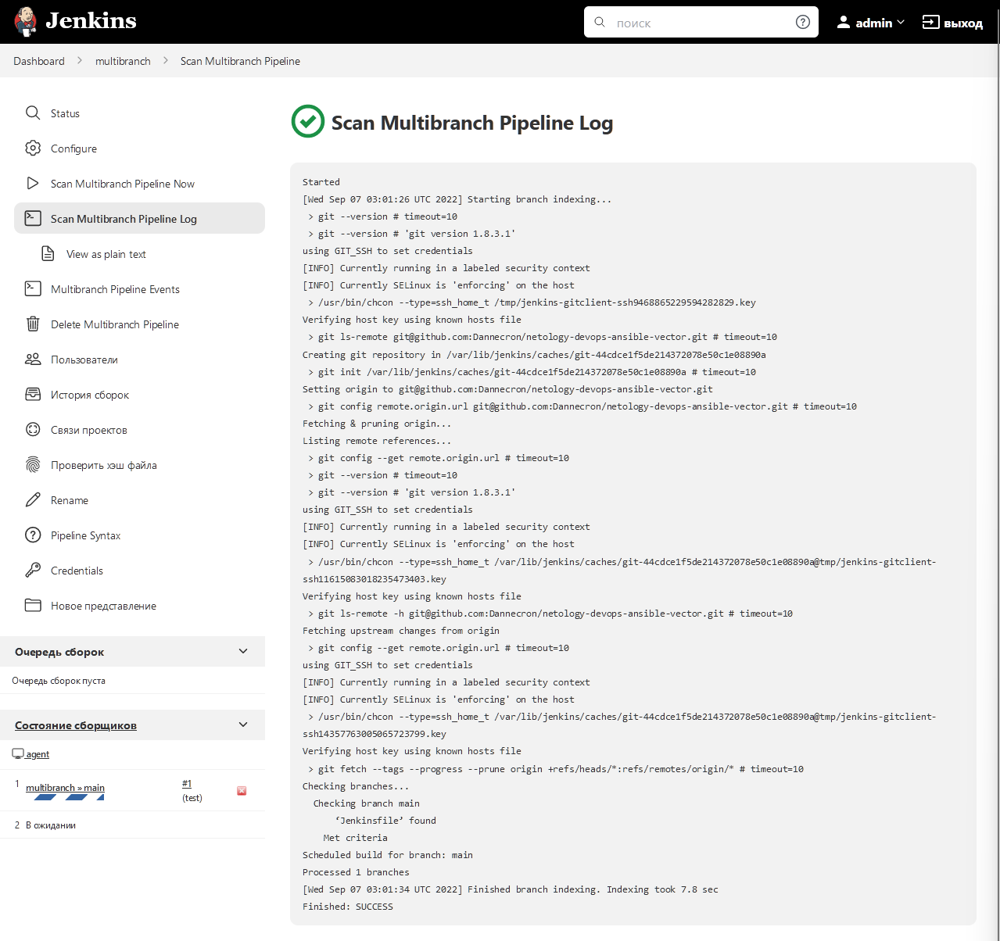
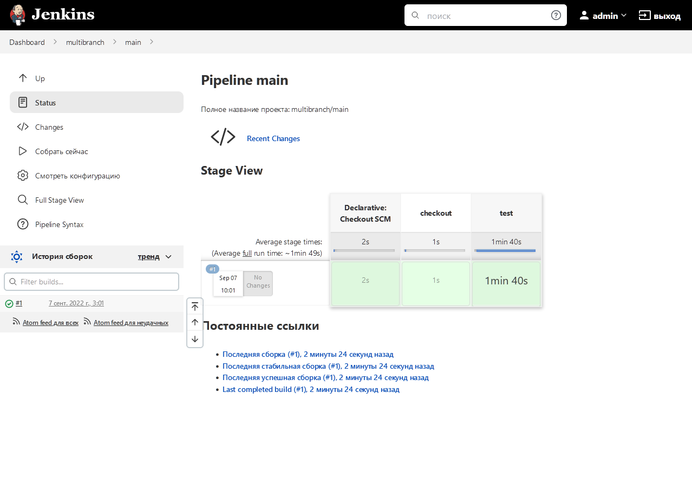
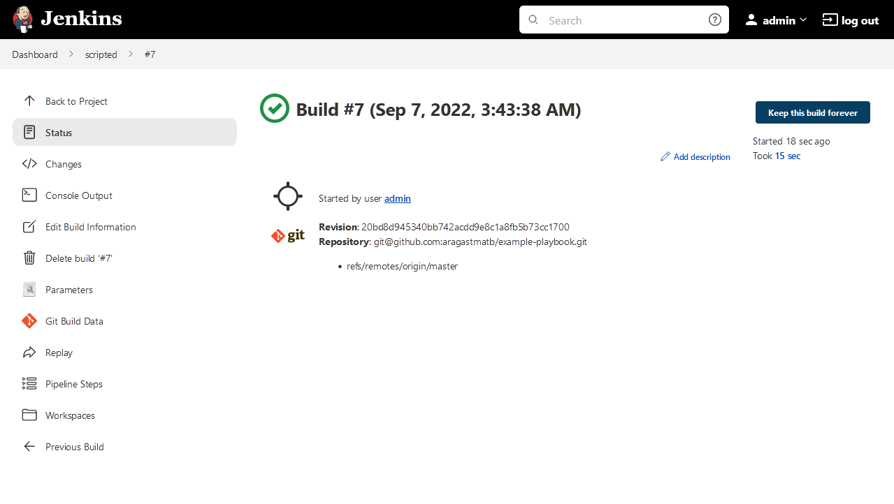

Выполнение [домашнего задания](https://github.com/netology-code/mnt-homeworks/blob/MNT-13/09-ci-04-jenkins/README.md)
по теме "9.4. Jenkins".

## Q/A

### Задание 1

> Подготовка к выполнению
> 
> 1. Создать 2 VM: для jenkins-master и jenkins-agent.
> 2. Установить jenkins при помощи playbook'a.
> 3. Запустить и проверить работоспособность.
> 4. Сделать первоначальную настройку.

[Playbook](./infrastructure/site.yml) для установки `jenkins`. Были сделаны следующие доработки в сравнении
с оригинальным `playbook`:
- На мастере и агенте `github.com` добавлен в `known_hosts` пользователя `jenkins`
- На агенте установлен `python3.8` из исходников
- Добавлена установка `molecule` и других модулей для запуска тестирования ролей ansible

Запуск:

```shell
ansible-playbook -i inventory/hosts.yml site.yml
```

```text
<...>
PLAY RECAP *********************************************************************************************
jenkins-agent-01           : ok=18   changed=15   unreachable=0    failed=0    skipped=0    rescued=0    ignored=0
jenkins-master-01          : ok=11   changed=9    unreachable=0    failed=0    skipped=0    rescued=0    ignored=0
```


После первоначальной настройки будет выведен dashboard с настройками `jenkins`:


Следующим шагом необходимо отключить мастер-ноду от процесса запуска сборок.
Для этого достаточно перейти на страницу `/computer/(built-in)/configure` и выставить настройку
`Количество процессов-исполнителей` в 0 и сохранить.

Добавление нового агента возможно на странице `/computer/new`.
Важные настройки, которые необходимо выставить:
- `Корень удаленной ФС` - нужно задать значение из переменной ansible `jenkins_agent_dir`
- `Количество процессов-исполнителей` - лучше задать 2 (по умолчанию установлен 1)
- `Способ запуска` - нужно выбрать `Launch agent via  execution of comand on the controller`.
Команда выглядит следующим образом:
    ```shell
    ssh {{jenkins-agent-01}} java -jar {{jenkins_agent_dir}}/agent.jar
    ```

### Задание 2

> Основная часть
> 
> 1. Сделать Freestyle Job, который будет запускать `molecule test` из любого вашего репозитория с ролью.

В качестве репозитория для запуска тестов будет использован [netology-devops-ansible-vector](https://github.com/Dannecron/netology-devops-ansible-vector).

Создание нового job находится на странице `/view/all/newJob`. Основные конфигурации, которые необходимо проставить:
- `Управление исходным кодом` - `Git`. Так же необходимо создать новый `Credential` с пользователем `git` и любым приватным ключом,
прописанным у пользователя `github`. Дополнительно стоит задать осмысленное название в `ID`. Ещё очень важно, чтобы `github.com` был добавлен в `known_host` пользователя `jenkins`
на всех машинах.
- `Триггеры сборки` - можно активировать `Опрашивать SCM об изменениях` и выставить рекомендованное расписание `H * * * *` (раз в час).
- `Сборка` - достаточно добавить только один шаг сборки `Выполнить команду shell` и добавить в неё `molecule test`

Результат job:


> 2. Сделать Declarative Pipeline Job, который будет запускать `molecule test` из любого вашего репозитория с ролью.

Для данного типа pipeline необходимо только добавить `Триггеры сборки`, как и для предыдущего типа,
а так же задать скрипт:

```text
pipeline {
    agent any

    stages {
        stage('checkout') {
            steps {
                echo 'Hello World'
                git credentialsId: '6659caf8-95a2-4201-b6e0-bfe65e71836d', 
                url: 'git@github.com:Dannecron/netology-devops-ansible-vector.git',
                branch: 'main'
            }
        }
        stage('test') {
            steps {
                echo 'Run molecule test'
                sh 'molecule test'
            }
        }
    }
}
```

Где значение для `credentialsId` нужно взять из `ID` credentials, созданных для git на предыдущем pipeline.

Из данного скрипта можно создать [`JenkinsfileMultibranch`](pipeline/JenkinsfileMultibranch), который будет использоваться на следующем шаге.


> 3. Перенести Declarative Pipeline в репозиторий в файл `Jenkinsfile`.
> 4. Создать Multibranch Pipeline на запуск `Jenkinsfile` из репозитория.

[`JenkinsfileMultibranch`](pipeline/JenkinsfileMultibranch) перенесён в репозиторий [netology-devops-ansible-vector](https://github.com/Dannecron/netology-devops-ansible-vector).

При создании необходимо заполнить следующие поля:
* `Branch Sources` - репозиторий с `Jenkinsfile`, в данном случае не будет отличий от тестируемого репозитория.

После создания автоматически начнётся сканирование объектов репозитория, а после этого будет запущена сборка на 
ветке по умолчанию.




> 5. Создать Scripted Pipeline, наполнить его скриптом из [pipeline](./pipeline).

Для создания `Scripted Pipeline` нужно создать `Declarative Pipeline`, как это было на шаге 2.
Дополнительно необходимо указать `This project is parameterized` и добавить параметр `prod_run`.
Для простоты этот параметр лучше задать строкой.

> 6. Внести необходимые изменения, чтобы Pipeline запускал `ansible-playbook` без флагов `--check --diff`,
> если не установлен параметр при запуске джобы (prod_run = True), по умолчанию параметр имеет значение False
> и запускает прогон с флагами `--check --diff`.

Необходимо внести следующие изменения:
* название `node` изменить, на то, что было указано при подключении агента
* заменить `credentialsId`

Изменённый скрипт расположен в файле [JenkinsfileScripted](./pipeline/JenkinsfileScripted)

> 7. Проверить работоспособность, исправить ошибки, исправленный Pipeline вложить в репозиторий в файл `ScriptedJenkinsfile`.
> 8. Отправить ссылку на репозиторий с ролью и Declarative Pipeline и Scripted Pipeline.

Для работы данного playbook необходимо:
* добавить пользователя `jenkins` на машине `jenkins-agent-01` в `sudoers`, отключив проверку по паролю
* создать директорию `/opt/jdk/openjdk-11`

В противном случае pipeline будет отрабатывать с ошибкой.


