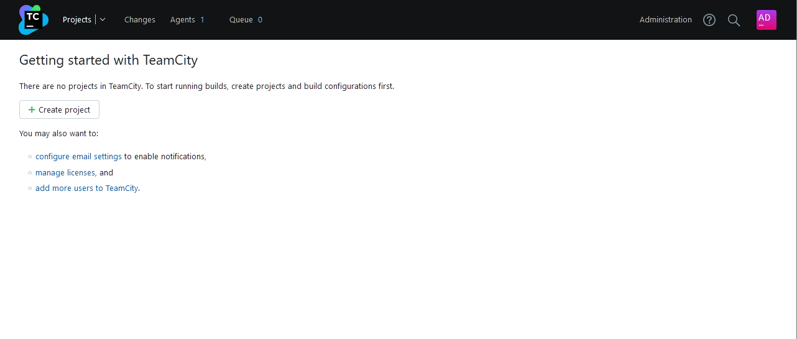
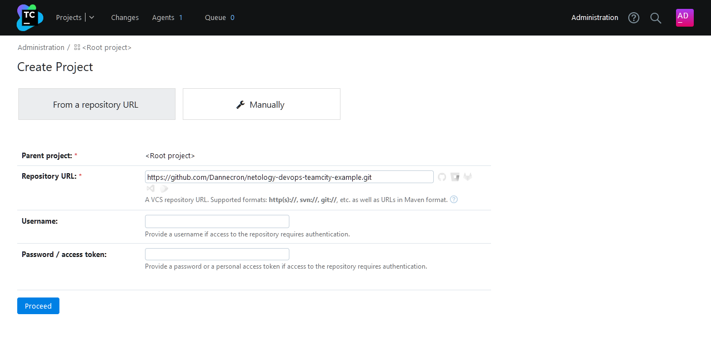
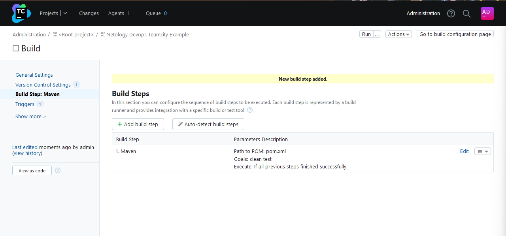
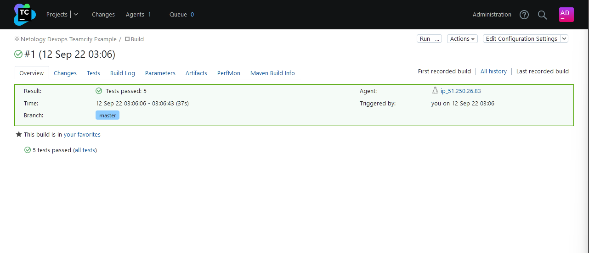
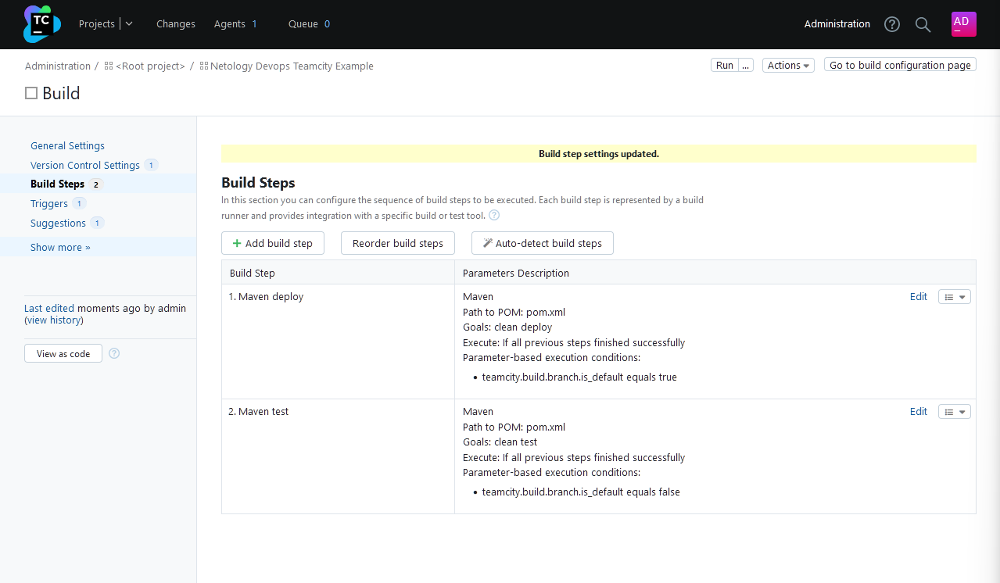
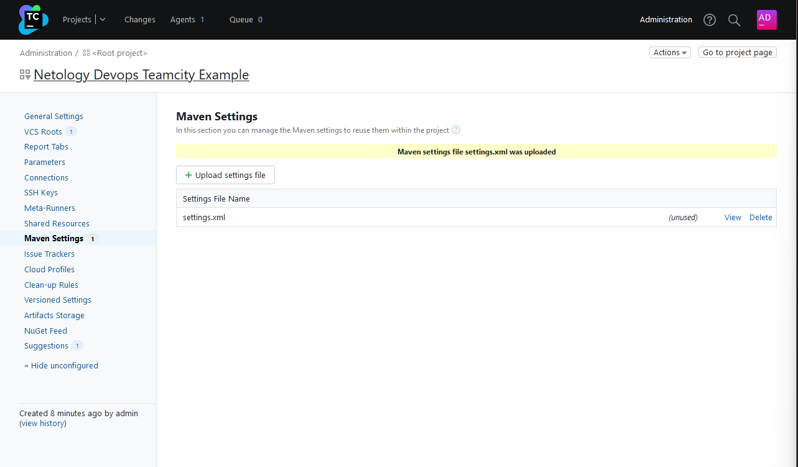
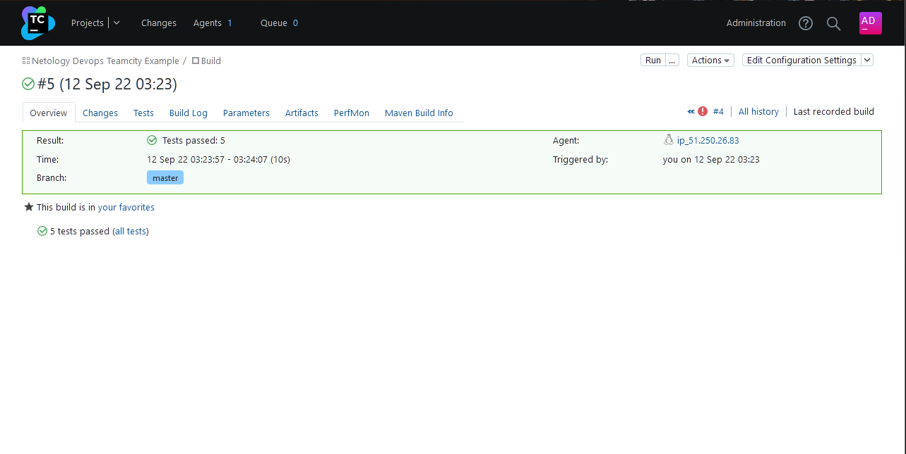
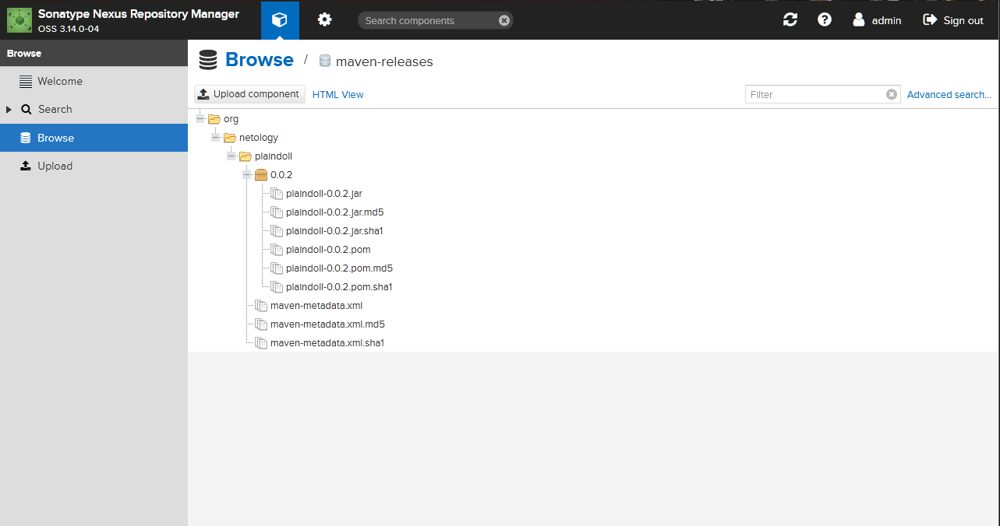
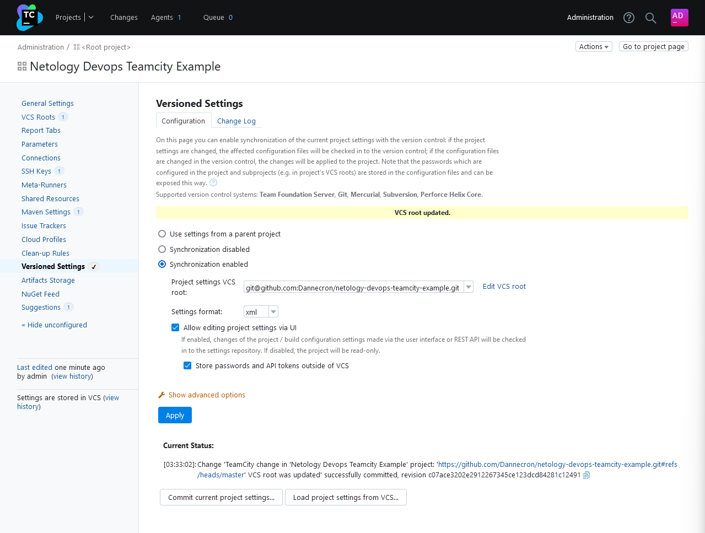
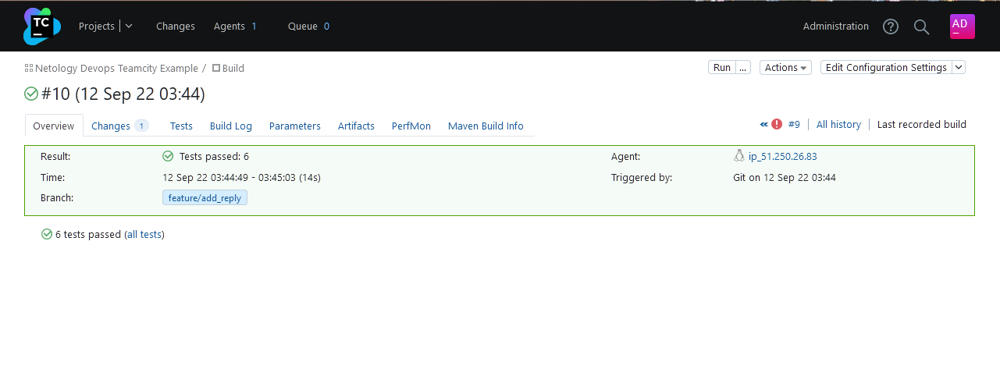

Выполнение [домашнего задания](https://github.com/netology-code/mnt-homeworks/blob/MNT-13/09-ci-05-teamcity/README.md)
по теме "9.5. Teamcity"

## Q/A

### Задание 1

> Подготовка к выполнению
> 1. В Ya.Cloud создайте новый инстанс (4CPU4RAM) на основе образа `jetbrains/teamcity-server`
> 2. Дождитесь запуска teamcity, выполните первоначальную настройку
> 3. Создайте ещё один инстанс(2CPU4RAM) на основе образа `jetbrains/teamcity-agent`. Пропишите к нему переменную окружения `SERVER_URL: "http://<teamcity_url>:8111"`
> 4. Авторизуйте агент
> 5. Сделайте fork [репозитория](https://github.com/aragastmatb/example-teamcity)
> 6. Создать VM (2CPU4RAM) и запустить [playbook](./infrastructure)

Форк репозитория: [netology-devops-teamcity-example](https://github.com/Dannecron/netology-devops-teamcity-example).



### Задание 2

> Основная часть
> 1. Создайте новый проект в teamcity на основе fork



> 2. Сделайте autodetect конфигурации
> 3. Сохраните необходимые шаги, запустите первую сборку master'a





> 4. Поменяйте условия сборки: если сборка по ветке `master`, то должен происходит `mvn clean deploy`, иначе `mvn clean test`



> 5. Для deploy будет необходимо загрузить [settings.xml](./teamcity/settings.xml) в набор конфигураций maven у teamcity, предварительно записав туда креды для подключения к nexus
> 6. В pom.xml необходимо поменять ссылки на репозиторий и nexus



> 7. Запустите сборку по master, убедитесь что всё прошло успешно, артефакт появился в nexus





> 8. Мигрируйте `build configuration` в репозиторий



> 9. Создайте отдельную ветку `feature/add_reply` в репозитории

```shell
git branch -C feature/add_reply && git switch feature/add_reply
```

> 10. Напишите новый метод для класса Welcomer: метод должен возвращать произвольную реплику, содержащую слово `hunter`
> 11. Дополните тест для нового метода на поиск слова `hunter` в новой реплике
> 12. Сделайте push всех изменений в новую ветку в репозиторий

Ветка с изменениями: [feature/add_reply](https://github.com/Dannecron/netology-devops-teamcity-example/tree/feature/add_reply)

> 13. Убедитесь что сборка самостоятельно запустилась, тесты прошли успешно



> 14. Внесите изменения из произвольной ветки `feature/add_reply` в `master` через `Merge`
> 15. Убедитесь, что нет собранного артефакта в сборке по ветке `master`
> 16. Настройте конфигурацию так, чтобы она собирала `.jar` в артефакты сборки

Конфигурация уже настроена на сборку `jar`. При мерже в мастер сборка запустилась автоматически,
так как изначально кофигурация проверяет все изменения всех веток в репозитории.

> 17. Проведите повторную сборку мастера, убедитесь, что сбора прошла успешно и артефакты собраны

Поменяли `pom.xml`, вписав новую версию. Сборка запустилась автоматически и успешно опубликовала артефакты в `nexus`.

> 18. Проверьте, что конфигурация в репозитории содержит все настройки конфигурации из teamcity
> 19. В ответ предоставьте ссылку на репозиторий

[netology-devops-teamcity-example](https://github.com/Dannecron/netology-devops-teamcity-example)
