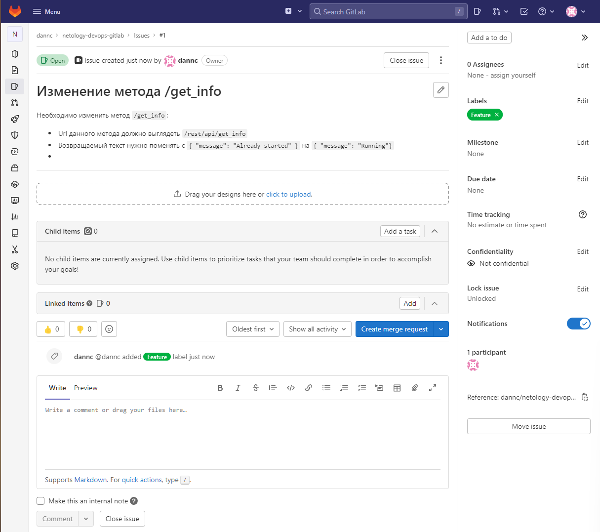
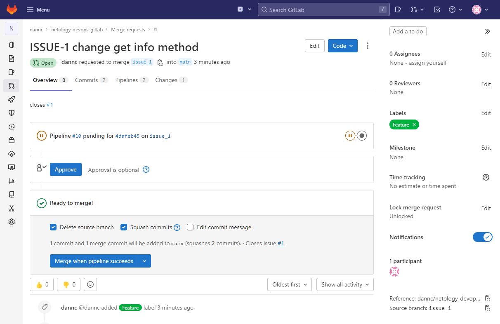

Выполнение [домашнего задания](https://github.com/netology-code/mnt-homeworks/blob/MNT-13/09-ci-06-gitlab/README.md)
по теме "9.6. Gitlab"

## Q/A

### Задание 1

> Подготовка к выполнению
> 1. Необходимо [подготовить gitlab к работе по инструкции](https://cloud.yandex.ru/docs/tutorials/infrastructure-management/gitlab-containers)
> 2. Создайте свой новый проект
> 3. Создайте новый репозиторий в gitlab, наполните его [файлами](./repository)
> 4. Проект должен быть публичным, остальные настройки по желанию

Ссылка на проект: [https://netology-sao.gitlab.yandexcloud.net/dannc/netology-devops-gitlab](https://netology-sao.gitlab.yandexcloud.net/dannc/netology-devops-gitlab).

Зеркало проекта на github: [dannecron/netology-devops-gitlab](https://github.com/Dannecron/netology-devops-gitlab).

### Задание 2

> Основная часть
>
> #### DevOps
> В репозитории содержится код проекта на python. Проект - RESTful API сервис. Ваша задача автоматизировать сборку образа с выполнением python-скрипта:
> 1. Образ собирается на основе [centos:7](https://hub.docker.com/_/centos?tab=tags&page=1&ordering=last_updated)
> 2. Python версии не ниже 3.7
> 3. Установлены зависимости: `flask` `flask-restful`
> 4. Создана директория `/python_api`
> 5. Скрипт из репозитория размещён в /python_api
> 6. Точка вызова: запуск скрипта
> 7. Если сборка происходит на ветке `master`: должен подняться pod kubernetes на основе образа `python-api`, иначе этот шаг нужно пропустить


`Dockerfile` для приложения выглядит следующим образом:

```dockerfile
FROM centos:7

RUN yum install -y python3 curl
COPY src/requirements.txt /tmp/requirements.txt

RUN pip3 install -r /tmp/requirements.txt

COPY src/ /python_api/

EXPOSE 5290

CMD ["python3", "/python_api/python-api.py"]
```

В gitlab-ci выделено 3 стадии:
- `build`
- `test` (для необязательного задания)
- `deploy`

В рамках `build` производится два пайплайна:
- `pre-build`: формирование тэга для образа: на дефолтной ветке сборка идёт с тэгом `latest`, на MR с названием ветки.

  ```yaml
  ---
  pre-build:
  image: busybox:latest
  stage: build
  script:
    - |
      if [[ "$CI_COMMIT_BRANCH" == "$CI_DEFAULT_BRANCH" ]]; then
        tag="latest"
        echo "Running on default branch '$CI_DEFAULT_BRANCH': tag = 'latest'"
      else
        tag="$CI_COMMIT_REF_SLUG"
        echo "Running on branch '$CI_COMMIT_BRANCH': tag = $tag"
      fi
    - echo "DOCKER_IMAGE=netology-devops-gitlab:${tag}" > docker.env
  artifacts:
    reports:
      dotenv:
        docker.env
  ```

- `docker-build`: построение и отправка образа в registry.

  ```yaml
  docker-build:
    stage: build
    variables:
      DOCKER_DRIVER: overlay2
      DOCKER_TLS_CERTDIR: ""
      DOCKER_HOST: tcp://localhost:2375/
    image: cr.yandex/yc/metadata-token-docker-helper:0.2
    services:
      - docker:19.03.1-dind
    needs:
      - pre-build
    script:
      - docker build --pull -t "cr.yandex/${YA_DOCKER_REGISTRY}/${DOCKER_IMAGE}" -f docker/Dockerfile .
      - docker push "cr.yandex/${YA_DOCKER_REGISTRY}/${DOCKER_IMAGE}"
    rules:
      - if: $CI_COMMIT_BRANCH
        exists:
          - docker/Dockerfile
  ```

В данных пайплайнах используется переменная `YA_DOCKER_REGISTRY`, которая добавлена в CI/CD-переменные проекта.
Все остальные переменные `CI_*` являются предопределёнными.

Стадия `deploy` состоит из одного шага:

```yaml
deploy:
  image: gcr.io/cloud-builders/kubectl:latest
  stage: deploy
  needs:
    - pre-build
    - docker-build
  script:
    - kubectl config set-cluster k8s --server="$KUBE_URL" --insecure-skip-tls-verify=true
    - kubectl config set-credentials admin --token="$KUBE_TOKEN"
    - kubectl config set-context default --cluster=k8s --user=admin
    - kubectl config use-context default
    - sed -i "s/__YA_REGISTRY__/${YA_DOCKER_REGISTRY}/" docker/k8s.yaml
    - sed -i "s/__DOCKER_IMAGE__/${DOCKER_IMAGE}/" docker/k8s.yaml
    - kubectl apply -f docker/k8s.yaml
```

Успешность деплоя можно проверить 

> #### Product Owner
> Вашему проекту нужна бизнесовая доработка: необходимо поменять JSON ответа на вызов метода GET `/rest/api/get_info`, необходимо создать Issue в котором указать:
> 1. Какой метод необходимо исправить
> 2. Текст с `{ "message": "Already started" }` на `{ "message": "Running" }`
> 3. Issue поставить label: feature

Ссылка на issue: [https://netology-sao.gitlab.yandexcloud.net/dannc/netology-devops-gitlab/-/issues/1](https://netology-sao.gitlab.yandexcloud.net/dannc/netology-devops-gitlab/-/issues/1)



> #### Developer
> Вам пришел новый Issue на доработку, вам необходимо:
> 1. Создать отдельную ветку, связанную с этим issue
> 2. Внести изменения по тексту из задания
> 3. Подготовить Merge Request, влить необходимые изменения в `master`, проверить, что сборка прошла успешно

Merge-request: [https://netology-sao.gitlab.yandexcloud.net/dannc/netology-devops-gitlab/-/merge_requests/1](https://netology-sao.gitlab.yandexcloud.net/dannc/netology-devops-gitlab/-/merge_requests/1).



> #### Tester
> Разработчики выполнили новый Issue, необходимо проверить валидность изменений:
> 1. Поднять докер-контейнер с образом `python-api:latest` и проверить возврат метода на корректность
> 2. Закрыть Issue с комментарием об успешности прохождения, указав желаемый результат и фактически достигнутый

Для проверки необходимо авторизоваться в registry и выполнить команду 

```shell
docker run --rm -d -p "5290:5290" cr.yandex/crp4ua679vouef3vqg87/netology-devops-gitlab:issue-1
```

А затем выполнить curl-запрос на `localhost:5290`.

> ####
> Автоматизируйте работу тестировщика, пусть у вас будет отдельный конвейер, который автоматически поднимает контейнер и выполняет проверку, например, при помощи curl.
> На основе вывода - будет приниматься решение об успешности прохождения тестирования.

Для автоматизации работы тестировщика в рамках стейджа `test` был написан pipeline:

```yaml
test-api:
  image: alpine/curl:latest
  stage: test
  variables:
    PYTHON_API_HOSTNAME: python-api
  services:
    - name: "cr.yandex/${YA_DOCKER_REGISTRY}/${DOCKER_IMAGE}"
      alias: python-api
  needs:
    - pre-build
    - docker-build
  script:
    - ./test/validate_api.sh
```

> #### Итог
> После успешного прохождения всех ролей - отправьте ссылку на ваш проект в гитлаб, как решение домашнего задания

Ссылка на проект в gitlab находится в начале данного документа.
