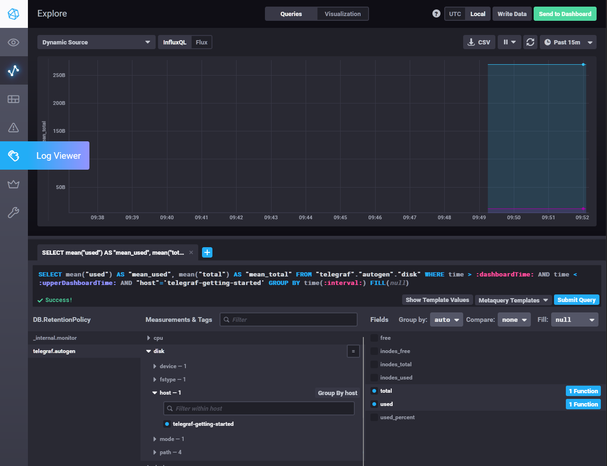
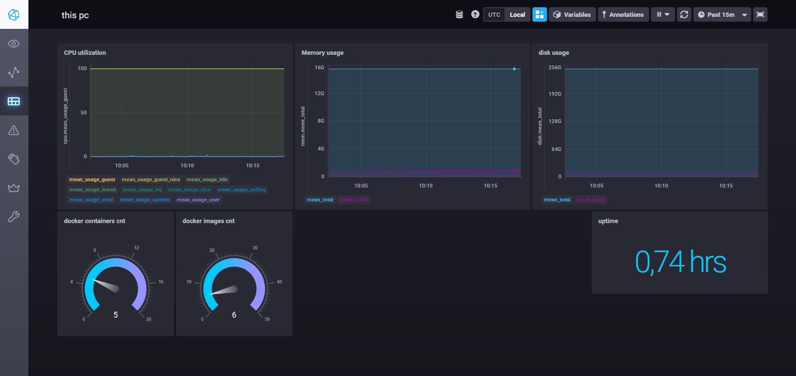

Выполнение [домашнего задания](https://github.com/netology-code/mnt-homeworks/blob/MNT-13/10-monitoring-02-systems/README.md)
по теме "10.2. Системы мониторинга"

## Q/A

### Задание 1

> Опишите основные плюсы и минусы pull и push систем мониторинга

#### Pull-модель

Плюсы:
* явное определение сервисов, с которых собираются данные, то есть отсутствие данных,
получаемых из неожиданных мест
* возможность контролировать периодичность сбора метрик
* возможность защитить методы получения метрик на стороне сервисов различными способами (basic-аутентификация,tls-сертификаты, клиентские сертификаты)
* простая модель получения данных, которая подразумевает упрощённые методы отладки

Минусы:
* необходимость изменять конфигурацию сборщика для добавления новых сервисов либо сконфигурировать autodiscovery
* при нагрузке на сервис есть вероятность, что сборщик не сможет получить метрики

#### Push-модель

Плюсы:
* для начала сбора метрик достаточно установить агента
* возможность использовать протокол udp для отдачи метрик

Минусы:
* агент - дополнительная точка отказа. Таким образом, есть вероятность,
что сервис работает в штатном режиме, а вот агент перестал работать.
* сложная отладка отправки метрик

### Задание 2

> Какие из ниже перечисленных систем относятся к push модели, а какие к pull? А может есть гибридные?
>
> * Prometheus
> * TICK
> * Zabbix
> * VictoriaMetrics
> * Nagios

| Сервис          | Модель | Дополнительный комментарий                                                                                                                                                             |
|-----------------|--------|----------------------------------------------------------------------------------------------------------------------------------------------------------------------------------------|
| Prometheus      | pull   | есть механизм [pushgateway](https://prometheus.io/docs/practices/pushing/), у которого prometheus собирает метрики по pull-модели                                                      |
| TICK            | push   |                                                                                                                                                                                        |
| Zabbix          | hybrid | основная модель - pull (сбор данных с агентов), но есть возможность использовать push-модель через [zabbix-sender](https://www.zabbix.com/documentation/5.2/ru/manual/concepts/sender) |
| VictoriaMetrics | hybrid |                                                                                                                                                                                        |
| Nagios          | hybrid | есть агенты, которые работают по pull-модели, но так же есть поддержка push-модели по протоколу `SNMP`                                                                                 |

### Задание 3

> Склонируйте себе [репозиторий](https://github.com/influxdata/sandbox/tree/master) и запустите TICK-стэк,
> используя технологии docker и docker-compose.(по инструкции ./sandbox up )
> 
> В виде решения на это упражнение приведите выводы команд с вашего компьютера (виртуальной машины):
> 
>     - curl http://localhost:8086/ping
>     - curl http://localhost:8888
>     - curl http://localhost:9092/kapacitor/v1/ping
> 
> А также скриншот веб-интерфейса ПО chronograf (`http://localhost:8888`).

```shell
curl -v http://localhost:8086/ping
```

```text
*   Trying 127.0.0.1:8086...
* TCP_NODELAY set
* Connected to localhost (127.0.0.1) port 8086 (#0)
> GET /ping HTTP/1.1
> Host: localhost:8086
> User-Agent: curl/7.68.0
> Accept: */*
>
* Mark bundle as not supporting multiuse
< HTTP/1.1 204 No Content
< Content-Type: application/json
< Request-Id: 8bb4e1e6-4069-11ed-8018-0242ac500203
< X-Influxdb-Build: OSS
< X-Influxdb-Version: 1.8.10
< X-Request-Id: 8bb4e1e6-4069-11ed-8018-0242ac500203
< Date: Fri, 30 Sep 2022 02:42:37 GMT
<
* Connection #0 to host localhost left intact
```

```shell
curl http://localhost:8888
```

```html
<!DOCTYPE html>
<html>
    <head>
        <link rel="stylesheet" href="/index.c708214f.css">
        <meta http-equiv="Content-type" content="text/html; charset=utf-8">
        <title>Chronograf</title>
        <link rel="icon shortcut" href="/favicon.70d63073.ico">
    </head>
    <body> 
    <div id="react-root" data-basepath=""></div> 
    <script type="module" src="/index.e81b88ee.js"></script>
    <script src="/index.a6955a67.js" nomodule="" defer></script> 
    </body>
</html>
```

```shell
curl -v http://localhost:9092/kapacitor/v1/ping
```

```text
*   Trying 127.0.0.1:9092...
* TCP_NODELAY set
* Connected to localhost (127.0.0.1) port 9092 (#0)
> GET /kapacitor/v1/ping HTTP/1.1
> Host: localhost:9092
> User-Agent: curl/7.68.0
> Accept: */*
>
* Mark bundle as not supporting multiuse
< HTTP/1.1 204 No Content
< Content-Type: application/json; charset=utf-8
< Request-Id: dfe72552-4069-11ed-8029-0242ac500204
< X-Kapacitor-Version: 1.6.5
< Date: Fri, 30 Sep 2022 02:44:59 GMT
<
* Connection #0 to host localhost left intact
```


### Задание 4

> Изучите список [telegraf inputs](https://github.com/influxdata/telegraf/tree/master/plugins/inputs).
> - Добавьте в конфигурацию telegraf плагин - [disk](https://github.com/influxdata/telegraf/tree/master/plugins/inputs/disk):
> 
>     ```
>     [[inputs.disk]]
>     ignore_fs = ["tmpfs", "devtmpfs", "devfs", "iso9660", "overlay", "aufs", "squashfs"]
>     ```
> 
> - Так же добавьте в конфигурацию telegraf плагин - [mem](https://github.com/influxdata/telegraf/tree/master/plugins/inputs/mem):
> 
>     ```
>     [[inputs.mem]]
>     ```
>   
> - После настройки перезапустите telegraf.
> 
>     - Перейдите в веб-интерфейс Chronograf (`http://localhost:8888`) и откройте вкладку `Data explorer`.
>     - Нажмите на кнопку `Add a query`
>     - Изучите вывод интерфейса и выберите БД `telegraf.autogen`
>     - В `measurments` выберите mem->host->telegraf_container_id , а в `fields` выберите used_percent. 
>     Внизу появится график утилизации оперативной памяти в контейнере telegraf.
>     - Вверху вы можете увидеть запрос, аналогичный SQL-синтаксису. 
>     Поэкспериментируйте с запросом, попробуйте изменить группировку и интервал наблюдений.
>     - Приведите скриншот с отображением
>     метрик утилизации места на диске (disk->host->telegraf_container_id) из веб-интерфейса.



### Задание 5

> Добавьте в конфигурацию telegraf следующий плагин - [docker](https://github.com/influxdata/telegraf/tree/master/plugins/inputs/docker):
> 
> ```
> [[inputs.docker]]
>   endpoint = "unix:///var/run/docker.sock"
> ```
> 
> Дополнительно вам может потребоваться донастройка контейнера telegraf в `docker-compose.yml` дополнительного volume и
> режима privileged:
> ```
>   telegraf:
>     image: telegraf:1.4.0
>     privileged: true
>     volumes:
>       - ./etc/telegraf.conf:/etc/telegraf/telegraf.conf:Z
>       - /var/run/docker.sock:/var/run/docker.sock:Z
>     links:
>       - influxdb
>     ports:
>       - "8092:8092/udp"
>       - "8094:8094"
>       - "8125:8125/udp"
> ```
> 
> После настройки перезапустите telegraf, обновите веб интерфейс и приведите скриншотом список `measurments` в
> веб-интерфейсе базы telegraf.autogen. Там должны появиться метрики, связанные с docker.
> 
> Факультативно можете изучить какие метрики собирает telegraf после выполнения данного задания.

Метрики docker уже подключены по умолчанию следующей конфигурацией telegraph:

```text
[[inputs.docker]]
  endpoint = "unix:///var/run/docker.sock"
  container_names = []
  timeout = "5s"
  perdevice = true
  total = false
```


### Задание 6

> Дополнительное задание 
> 
> В веб-интерфейсе откройте вкладку `Dashboards`. Попробуйте создать свой dashboard с отображением: 
> - утилизации ЦПУ
> - количества использованного RAM
> - утилизации пространства на дисках
> - количество поднятых контейнеров
> - аптайм
> - ...
> - фантазируйте)


