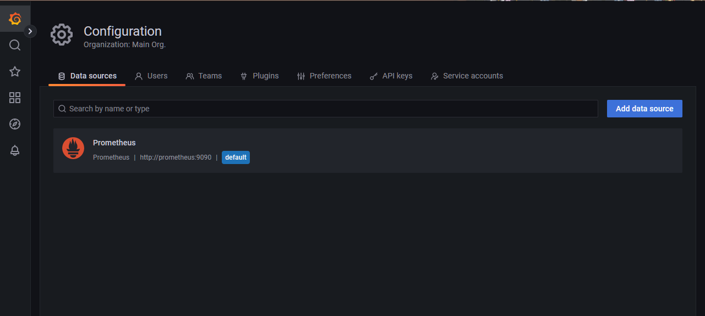
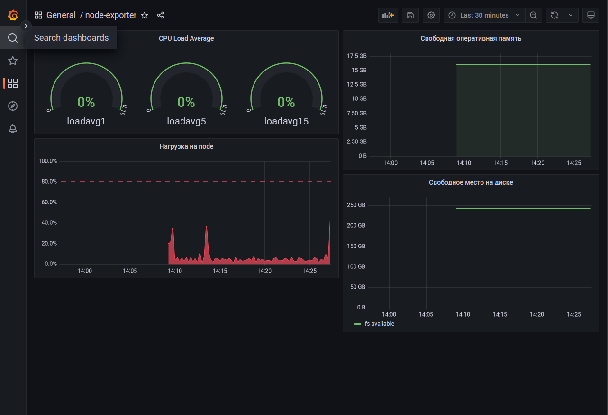
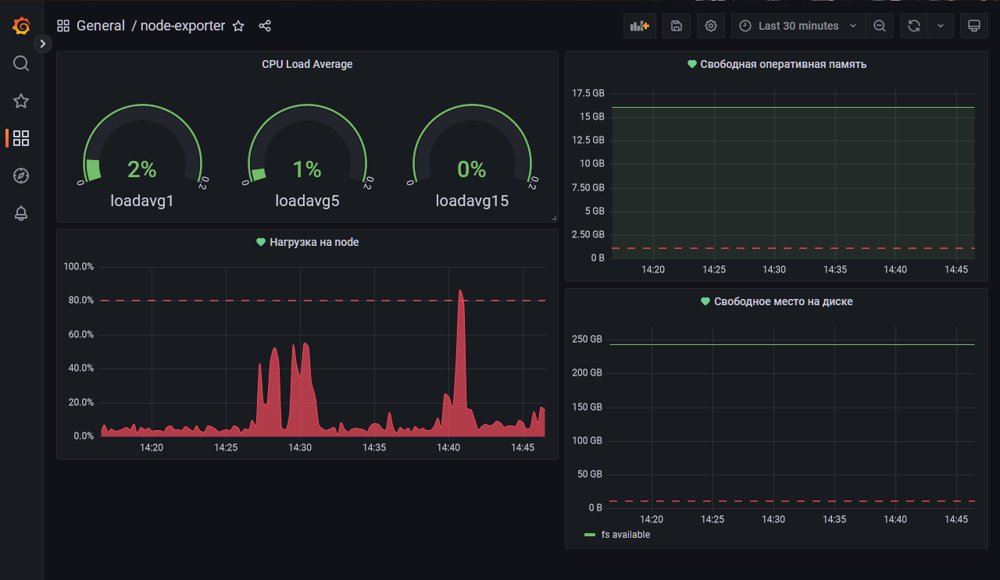

Выполнение [домашнего задания](https://github.com/netology-code/mnt-homeworks/blob/MNT-13/10-monitoring-03-grafana/README.md)
по теме "10.3. Системы Grafana"

## Q/A

### Задание 1

> Cамостоятельно разверните grafana, где в роли источника данных будет выступать prometheus, а сборщиком данных node-exporter:
> 
> * `grafana`
> * `prometheus-server`
> * `prometheus node-exporter`
> 
> Запустите связку prometheus-grafana.
> Зайдите в веб-интерфейс Grafana, используя авторизационные данные, указанные в манифесте docker-compose.
> Подключите поднятый вами prometheus как источник данных.
> Решение домашнего задания - скриншот веб-интерфейса grafana со списком подключенных Datasource.
> В решении к домашнему заданию приведите также все конфигурации/скрипты/манифесты, которые вы использовали в процессе решения задания.

`docker-compose` и остальная конфигурация расположена в директории [stack](./stack).
При поднятии контейнеров в `grafana` автоматически создаётся `data-source` к `prometheus`,
а так же dashboard по мониторингу контейнера `prometheus`.



### Задание 2

> Изучите самостоятельно ресурсы:
> - [promql-for-humans](https://timber.io/blog/promql-for-humans/#cpu-usage-by-instance)
> - [understanding prometheus cpu metrics](https://www.robustperception.io/understanding-machine-cpu-usage)
> 
> Создайте Dashboard и в ней создайте следующие Panels:
> - Утилизация CPU для nodeexporter (в процентах, 100-idle)
> - CPULA 1/5/15
> - Количество свободной оперативной памяти
> - Количество места на файловой системе
> 
> Для решения данного ДЗ приведите promql запросы для выдачи этих метрик, а также скриншот получившейся Dashboard.

Метрики и текст запросов для них

- Утилизация CPU для nodeexporter (в процентах, 100-idle)

```text
100 * (1 - avg by(instance)(irate(node_cpu_seconds_total{mode="idle"}[1m])))
```

- CPULA 1/5/15

```text
avg(node_load1{})
avg(node_load5{})
avg(node_load15{})
```

- Количество свободной оперативной памяти

```text
node_memory_MemTotal_bytes - node_memory_Active_bytes
```

- Количество места на файловой системе

```text
node_filesystem_avail_bytes{mountpoint="/"}
```



### Задание 3

> Создайте для каждой Dashboard подходящее правило alert (можно обратиться к первой лекции в блоке "Мониторинг").
> Дополнительно нужно завести удобный для вас канал нотификации, например Telegram или Email и отправить туда тестовые события.
>
> Для решения ДЗ - приведите скриншот вашей итоговой Dashboard и скриншоты тестовых событий из каналов нотификаций.

Dashboard с настроенными alerts:



Тестовая нотификация в `discord`:

[grafana_discord_test_alert](./img/grafana_discord_test_alert.png)

### Задание 4

> Сохраните ваш Dashboard.
> 
> Для этого перейдите в настройки Dashboard, выберите в боковом меню "JSON MODEL".
> 
> Далее скопируйте отображаемое json-содержимое в отдельный файл и сохраните его.
> 
> В решении задания - приведите листинг этого файла.

Файл с dashboard: [stack/grafana/dashboard_backup.json](./stack/grafana/dashboard_backup.json)
