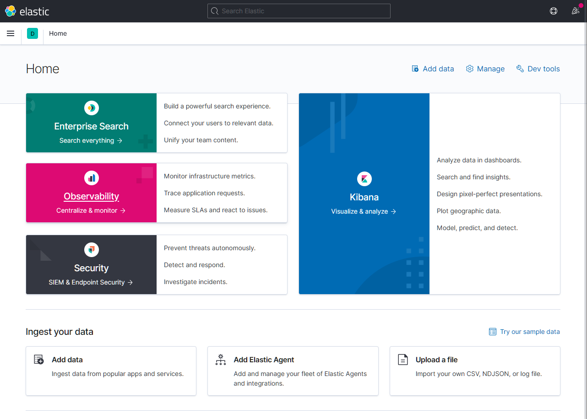
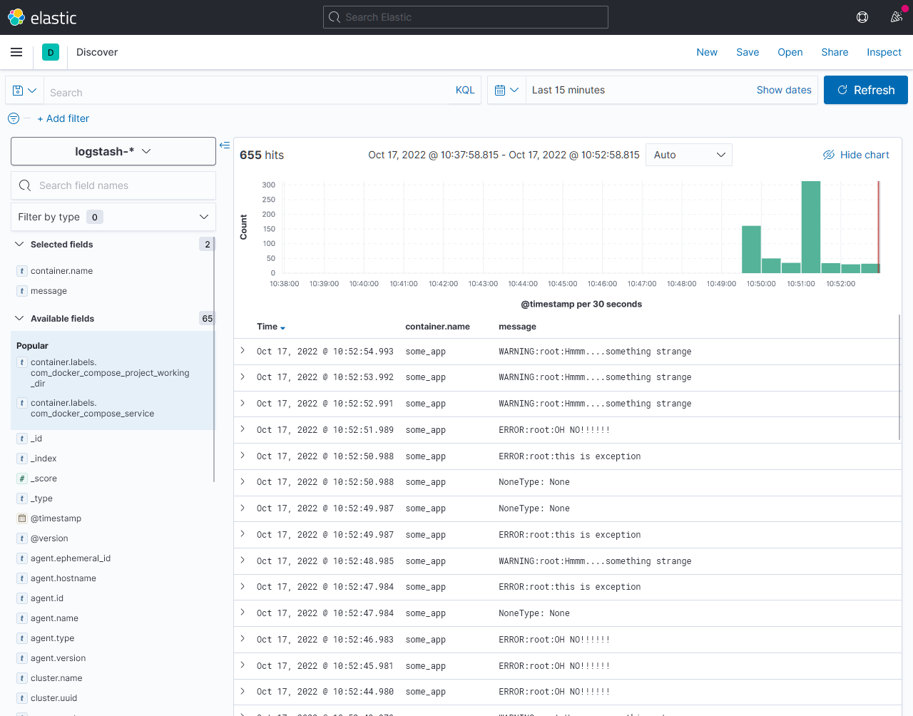

Выполнение [домашнего задания](https://github.com/netology-code/mnt-homeworks/blob/MNT-13/10-monitoring-04-elk/README.md)
по теме "10.4. ELK"

## Q/A

### Задание 1

> Вам необходимо поднять в докере:
> - elasticsearch(hot и warm ноды)
> - logstash
> - kibana
> - filebeat
> 
> и связать их между собой.
> 
> Logstash следует сконфигурировать для приёма по tcp json сообщений.
> 
> Filebeat следует сконфигурировать для отправки логов docker вашей системы в logstash.
> 
> В директории [help](./help) находится манифест docker-compose и конфигурации filebeat/logstash для быстрого
> выполнения данного задания.
> 
> Результатом выполнения данного задания должны быть:
> - скриншот `docker ps` через 5 минут после старта всех контейнеров (их должно быть 5)
> - скриншот интерфейса kibana
> - docker-compose манифест
> - ваши yml конфигурации для стека

Использовал готовый стэк из оригинального репозитория: [help](./help), но с некоторыми доработками:

- конфигурацию pipelines унёс в отдельную директорию и убрал из фильтра:
  - логи elk-стека, чтобы не было проблем с переполнением памяти
  - условия по json, так как pinger-приложение генерирует простую строку

```shell
docker-compose ps
```

```text
  Name                Command               State                              Ports
----------------------------------------------------------------------------------------------------------------
es-hot     /bin/tini -- /usr/local/bi ...   Up      0.0.0.0:9200->9200/tcp,:::9200->9200/tcp, 9300/tcp
es-warm    /bin/tini -- /usr/local/bi ...   Up      9200/tcp, 9300/tcp
filebeat   /usr/bin/tini -- /usr/loca ...   Up
kibana     /bin/tini -- /usr/local/bi ...   Up      0.0.0.0:5601->5601/tcp,:::5601->5601/tcp
logstash   /usr/local/bin/docker-entr ...   Up      5044/tcp, 0.0.0.0:5046->5046/tcp,:::5046->5046/tcp, 9600/tcp
some_app   python3 /opt/run.py              Up
```



### Задание 2

> Перейдите в меню создания index-patterns в kibana (http://localhost:5601/app/management/kibana/indexPatterns/create)
> и создайте несколько index-patterns из имеющихся.
> 
> Перейдите в меню просмотра логов в kibana (Discover) и самостоятельно изучите как отображаются логи и как производить
> поиск по логам.
> 
> В манифесте директории help также приведено dummy приложение, которое генерирует рандомные события в stdout контейнера.
> Данные логи должны порождать индекс logstash-* в elasticsearch. Если данного индекса нет - воспользуйтесь советами
> и источниками из раздела "Дополнительные ссылки" данного ДЗ.

Discover по созданному index pattern:



### Дополнительные ссылки

При выполнении задания пользуйтесь вспомогательными ресурсами:

- [поднимаем elk в докер](https://www.elastic.co/guide/en/elastic-stack-get-started/current/get-started-docker.html)
- [поднимаем elk в докер с filebeat и докер логами](https://www.sarulabs.com/post/5/2019-08-12/sending-docker-logs-to-elasticsearch-and-kibana-with-filebeat.html)
- [конфигурируем logstash](https://www.elastic.co/guide/en/logstash/current/configuration.html)
- [плагины filter для logstash](https://www.elastic.co/guide/en/logstash/current/filter-plugins.html)
- [конфигурируем filebeat](https://www.elastic.co/guide/en/beats/libbeat/5.3/config-file-format.html)
- [привязываем индексы из elastic в kibana](https://www.elastic.co/guide/en/kibana/current/index-patterns.html)
- [как просматривать логи в kibana](https://www.elastic.co/guide/en/kibana/current/discover.html)
- [решение ошибки increase vm.max_map_count elasticsearch](https://stackoverflow.com/questions/42889241/how-to-increase-vm-max-map-count)

В процессе выполнения задания могут возникнуть также не указанные тут проблемы в зависимости от системы.

Используйте output stdout filebeat/kibana и api elasticsearch для изучения корня проблемы и ее устранения.
