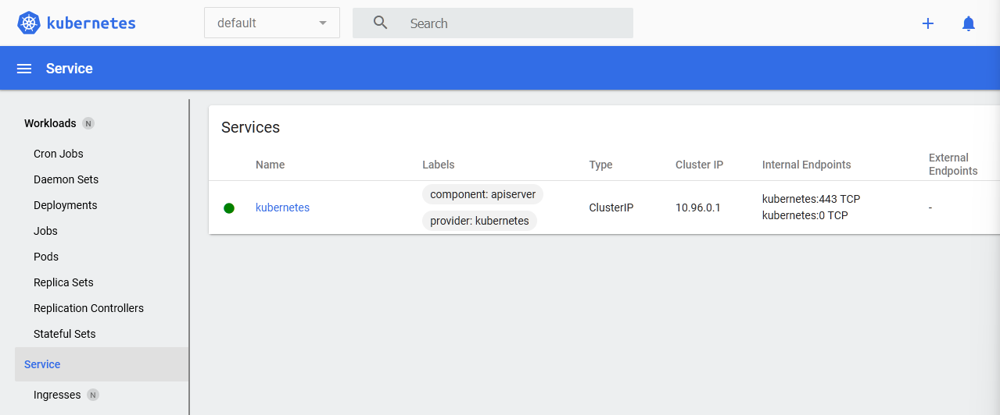

Выполнение [домашнего задания](https://github.com/netology-code/devkub-homeworks/blob/main/12-kubernetes-01-intro.md)
по теме "12.1 Компоненты Kubernetes"

## Q/A

### Задание 1

> Установить Minikube
>
> Для экспериментов и валидации ваших решений вам нужно подготовить тестовую среду для работы с Kubernetes.
> Оптимальное решение — развернуть на рабочей машине Minikube.
> 
> Как поставить на yandex.cloud:
> - создать виртуальную машину
> - подключитесь к серверу по ssh
> - установите миникуб и докер следующими командами:
>     - curl -LO https://storage.googleapis.com/kubernetes-release/release/`curl -s https://storage.googleapis.com/kubernetes-release/release/stable.txt`/bin/linux/amd64/kubectl
>     - chmod +x ./kubectl
>     - sudo mv ./kubectl /usr/local/bin/kubectl
>     - curl -Lo minikube https://storage.googleapis.com/minikube/releases/latest/minikube-linux-amd64 && chmod +x minikube && sudo mv minikube /usr/local/bin/
> - проверить версию можно командой minikube version
> - переключаемся на root и запускаем миникуб: minikube start --vm-driver=none
> - после запуска стоит проверить статус: minikube status
> - запущенные служебные компоненты можно увидеть командой: kubectl get pods --namespace=kube-system
>
> Для сброса кластера стоит удалить кластер и создать заново
> - minikube delete
> - minikube start --vm-driver=none
> 
> Возможно, для повторного запуска потребуется выполнить команду: sudo sysctl fs.protected_regular=0
> 
> Инструкция по установке Minikube - [ссылка](https://kubernetes.io/ru/docs/tasks/tools/install-minikube/)

Для начала нужно создать виртуальную машину в `yandex.cloud`. Затем подключиться к ней по ssh и выполнить команды по установке [`docker`](https://docs.docker.com/engine/install/ubuntu/) и `minikube`.
Результатом будет установленная утилита:

```shell
minikube version
```

```text
minikube version: v1.27.1
commit: fe869b5d4da11ba318eb84a3ac00f336411de7ba
```

Следующим шагом нужно запустить `minikube`:

```shell
minikube start --vm-driver=docker
```

Здесь используется драйвер `docker`, так как это [рекомендация из документации](https://minikube.sigs.k8s.io/docs/drivers/none/):

```text
Most users of this driver should consider the newer Docker driver, as it is significantly easier to configure and does not require root access. The ‘none’ driver is recommended for advanced users only.
```

Затем нужно проверить статус `minikube`:

```shell
minikube status
```

```text
minikube
type: Control Plane
host: Running
kubelet: Running
apiserver: Running
kubeconfig: Configured
```

```shell
kubectl get pods --namespace=kube-system
```

```text
NAME                               READY   STATUS    RESTARTS   AGE
coredns-565d847f94-8qpml           1/1     Running   0          66s
etcd-minikube                      1/1     Running   0          79s
kube-apiserver-minikube            1/1     Running   0          79s
kube-controller-manager-minikube   1/1     Running   0          79s
kube-proxy-dvrgd                   1/1     Running   0          66s
kube-scheduler-minikube            1/1     Running   0          79s
storage-provisioner                1/1     Running   0          73s
```

### Задание 2

> Запуск Hello World
> 
> После установки Minikube требуется его проверить. Для этого подойдет стандартное приложение hello world. А для доступа к нему потребуется ingress.
>
> - развернуть через Minikube тестовое приложение по [туториалу](https://kubernetes.io/ru/docs/tutorials/hello-minikube/#%D1%81%D0%BE%D0%B7%D0%B4%D0%B0%D0%BD%D0%B8%D0%B5-%D0%BA%D0%BB%D0%B0%D1%81%D1%82%D0%B5%D1%80%D0%B0-minikube)
> - установить аддоны ingress и dashboard

Активация dashboard:

```shell
minikube dashboard
```

Так как `minikube` по умолчанию делает доступ до dashboard только изнутри виртуальной машины,
то необходимо дополнительно запустить `kubectl proxy`, чтобы иметь возможность попасть в `dashboard` из-вне:

```shell
kubectl proxy --address='0.0.0.0' --disable-filter=true
```

Результат:


Для деплоя `hello-node` сервиса нужно выполнить команду:

```shell
kubectl create deployment hello-node --image=k8s.gcr.io/echoserver:1.4\
&& kubectl get deployments
```

```text
NAME         READY   UP-TO-DATE   AVAILABLE   AGE
hello-node   1/1     1            1           45s
```

```shell
kubectl get pods
```

```text
NAME                         READY   STATUS    RESTARTS   AGE
hello-node-697897c86-wczpg   1/1     Running   0          69s
```

Установка дополнений (только `ingress`, так как `dashboard` включён по умолчанию):

```shell
minikube addons enable ingress
```

Проверка установки:

```shell
minikube addons list
```

```text
|-----------------------------|----------|--------------|--------------------------------|
|         ADDON NAME          | PROFILE  |    STATUS    |           MAINTAINER           |
|-----------------------------|----------|--------------|--------------------------------|
| ambassador                  | minikube | disabled     | 3rd party (Ambassador)         |
| auto-pause                  | minikube | disabled     | Google                         |
| csi-hostpath-driver         | minikube | disabled     | Kubernetes                     |
| dashboard                   | minikube | enabled ✅   | Kubernetes                     |
| default-storageclass        | minikube | enabled ✅   | Kubernetes                     |
| ...                         | ...      | ...          | ...                            |
| ingress                     | minikube | enabled ✅   | Kubernetes                     |
| ingress-dns                 | minikube | disabled     | Google                         |
| ...                         | ...      | ...          | ...                            || registry-creds              | minikube | disabled     | 3rd party (UPMC Enterprises)   |
| storage-provisioner         | minikube | enabled ✅   | Google                         |
| storage-provisioner-gluster | minikube | disabled     | 3rd party (Gluster)            |
| volumesnapshots             | minikube | disabled     | Kubernetes                     |
|-----------------------------|----------|--------------|--------------------------------|
```

### Задание 3

> Установить kubectl
>
> Подготовить рабочую машину для управления корпоративным кластером. Установить клиентское приложение kubectl.
> - подключиться к minikube
> - проверить работу приложения из задания 2, запустив port-forward до кластера

Для подключения к `minikube` с другой машины необходимо:
- Взять конфигурацию `~/.kube/config` с виртуальной машины и перенести её в `~/.kube/minikube-config` со следующими изменениями:
  - закомментировать ключ `certificate-authority`, `client-certificate`, `client-key`
  - заменить значение ключа `server` на ip-адрес виртуальной машины и порт `8001` (обязательно должна выполняться команда `kubectl proxy`)

Пример полученного файла: [minikube-config](./minikube-config.yml)

После этого можно выполнять команды по работе с кластером:

```shell
 kubectl --kubeconfig ~/.kube/minikube-config cluster-info
```

```text
Kubernetes control plane is running at http://84.252.137.29:8001
CoreDNS is running at http://84.252.137.29:8001/api/v1/namespaces/kube-system/services/kube-dns:dns/proxy
```

Судя по [статье](https://habr.com/ru/company/vk/blog/648117/), проброс порта для сервиса `minikube` может происходить тремя разными способами:
- С помощью команды `minikube service <название сервиса>` 
- Использовать команду `port-forward`, чтобы сопоставить сервис и `localhost`
- Открыть порты (либо диапазоны портов) при запуске `minikube`

Но ни один из этих способов не дал возможности делать запросы с локального хоста на сервис внутри кластера `minikube`
