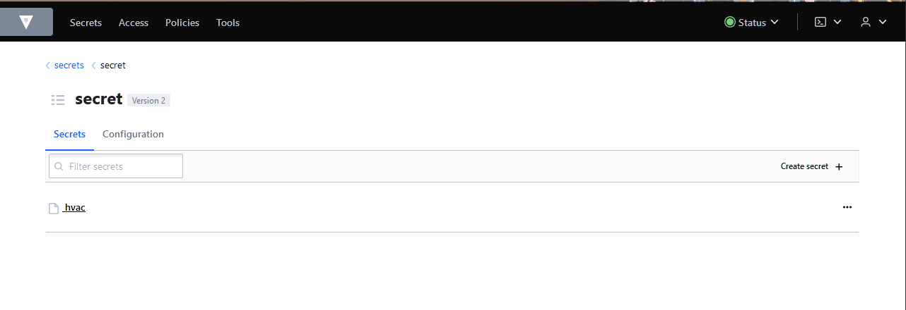

Выполнение [домашнего задания](https://github.com/netology-code/clokub-homeworks/blob/clokub-5/14.2.md)
по теме "14.2. Синхронизация секретов с внешними сервисами. Vault"

## Q/A

### Задача 1

> Работа с модулем Vault.
> 
> Запустить модуль Vault конфигураций через утилиту kubectl в установленном minikube
> 
> ```
> kubectl apply -f config/vault-pod.yml
> ```

```text
pod/14.2-netology-vault created
```

> Получить значение внутреннего IP пода
> 
> ```
> kubectl get pod 14.2-netology-vault -o json | jq -c '.status.podIPs'
> ```
> 
> Примечание: jq - утилита для работы с JSON в командной строке

```text
[{"ip":"10.233.102.130"}]
```

> Запустить второй модуль для использования в качестве клиента
> 
> ```
> kubectl run -i --tty fedora --image=fedora --restart=Never -- sh
> ```
> 
> Установить дополнительные пакеты
> 
> ```
> dnf -y install pip
> pip install hvac
> ```

```shell
pip list
```

```text
Package            Version
------------------ ---------
certifi            2022.12.7
charset-normalizer 2.1.1
gpg                1.17.0
hvac               1.0.2
idna               3.4
libcomps           0.1.18
pip                22.2.2
pyhcl              0.4.4
requests           2.28.1
rpm                4.18.0
setuptools         62.6.0
urllib3            1.26.13
```

> Запустить интерпретатор Python и выполнить следующий код, предварительно
> поменяв IP и токен
> 
> ```
> import hvac
> client = hvac.Client(
>     url='http://10.10.133.71:8200',
>     token='aiphohTaa0eeHei'
> )
> client.is_authenticated()
> 
> # Пишем секрет
> client.secrets.kv.v2.create_or_update_secret(
>     path='hvac',
>     secret=dict(netology='Big secret!!!'),
> )
> 
> # Читаем секрет
> client.secrets.kv.v2.read_secret_version(
>     path='hvac',
> )
> ```

Предварительно необходимо создать файл `vault.py`, поместить скрипт в него и запустить:

```shell
python3 vault.py
```

Следующим шагом необходимо проверить, что секрет успешно записался в `vault`. Для этого будет выполнено два шага:
* Выполнить `port-forward` до пода `vault`:

    ```shell
    kubectl port-forward pods/14.2-netology-vault 8200:8200
    ```

* Не выключая консоль зайти в web-версию `vault` по адресу `http://localhost:8200`, авторизоваться
  и просмотреть все секреты в хранилище `secrets`:

    
